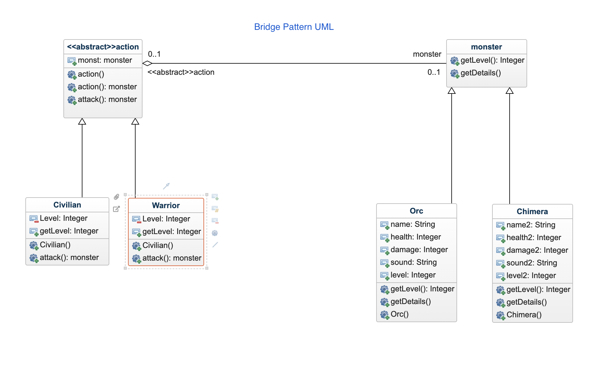

# Bridge Pattern

The bridge pattern is a design pattern used in software engineering that is meant to "decouple an abstraction from its implementation so that the two can vary independently", introduced by the Gang of Four. The bridge uses encapsulation, aggregation, and can use inheritance to separate responsibilities into different classes.

When a class varies often, the features of object-oriented programming become very useful because changes to a program's code can be made easily with minimal prior knowledge about the program. The bridge pattern is useful when both the class and what it does vary often. The class itself can be thought of as the abstraction and what the class can do as the implementation. The bridge pattern can also be thought of as two layers of abstraction.

# UML (Note: It forms a bridge shaped UML)

UML diagram:
- Abstraction : [action.java](example/action.java)
- RefinedAbstraction : [Civilian.java](example/Civilian.java) and [Warrior.java](example/Warrior.java)
- Implementor : [monster.java](example/monster.java)
- ConcreteImplementor : [Orc.java](example/Orc.java) and [Chimera.java](example/Chimera.java)

# Java Example

`action` is an abstract class, implemented by `Civilian` and `Warrior` classes. A seperated hierarchy in which `monster` interface is implemented by `Orc` and `Chimera`.
Using the Bridge design pattern, we decouple the `action` abstract class from its implementation, which is `Civilian` and `Warrior`.
`action` takes an instance of `monster` and runs its methods, thus decoupling the `action` and its implementations `Civilian` and `Warrior`
Here, each instance of `action` has a level, and if the level is greater than an instance of `monster` only then we can attack it.
Every instance of `action` is decoupled from its parent abstract class, and works depending on the `monster` instance.

# Problems Solved
- An abstraction and its implementation should be defined and extended independently from each other.
- A compile-time binding between an abstraction and its implementation should be avoided so that an implementation can be selected at run-time.
