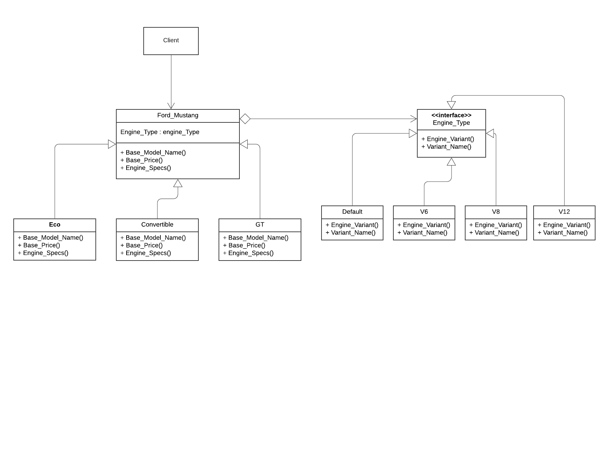

# Bridge

Bridge is a structural design pattern that lets you split a large class or a set of closely related classes into two separate hierarchies—abstraction and implementation—which can be developed independently of each other.



## Python example

In the example, [bridge.py](bridge.py)

Following are the elements of Bridge Design Pattern <br>

Abstraction : Core of the design pattern which contains reference to the implementor. In our case Ford_Mustang class is an abstraction.

Refined Abstraction : Extends the abstraction class. The classes GT, ECO, Convertible extends the Ford_Mustang class.

Implementer : Implemetor is nothing but the interface, in this example Engine_Type class is an interface. This interface does not need to correspond directly to the abstraction interface and can be very different.

Concrete Implementation : Implements the implementer interface. Classes Default, V6, V8, V12 are the actual implementations of the Engine_Type interface.

Bridge pattern actually prefer composition over inheritance.

## Running the example

```
$ python bridge.py


EcoBoost Fastback
Price:  26670
Default - 2.3L EcoBoost® Engine


EcoBoost Premium Convertible
Price:  46965
7.0L Ti-VCT V12 Engine (BULLITT™)


EcoBoost Fastback
Price:  30450
3.0L Ti-VCT V6 Engine (BULLITT™)


GT Fastback
Price:  44084
5.0L Ti-VCT V8 Engine (BULLITT™)


```