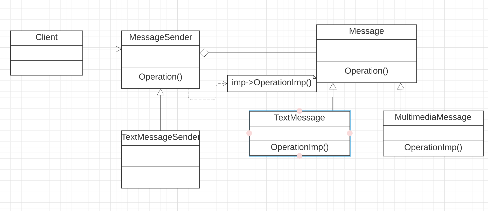

The implementation of Bridge Design Pattern discussed in the messaging system model example, demonstrates the Bridge Pattern.  
* The interface Message controls the other two hierarchies (Text Message and Multimedia message).  
* It maintains a reference to an object that is delegated by Message.  
* To extend the Message without changing the implementation class, we use TextMessageSender and MultimediaMessageSender.    
* The MessageSender typically provides the primitive operations while the Message defines the higher level operations based on those primitives.  
* In conclusion, the Bridge pattern is used to separate the interface, Message, from its implementation at the onset of a new Interface design which is the MessageSender.

The implemented code for Bridge can be found [here](bridge.rb)  

