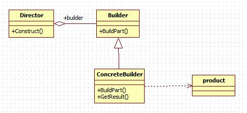

# Builder Pattern

Builder pattern aims to “Separate the construction of a complex object from its representation so that the same construction process can create different representations.” It is used to construct a complex object step by step and the final step will return the object. The process of constructing an object should be generic so that it can be used to create different representations of the same object.

# UML

# Java Example

In this example we are building a product, which is a Phone. The `Phone Class` [Phone.java](example/Phone.java), also called as Director contains following properties:
- OS
- RAM
- Screen Size
- Battery
- Camera
- Processor

`Phone Builder Class` [PhoneBuilder.java](example/PhoneBuilder.java) is called as the Builder. It is used to build the Phone Object by assigning the values to `Phone Class` [Phone.java](example/Phone.java) data members.

`Main(Shop)` [main_shop.java](example/main_shop.java) is the Concrete Builder, which calls the `Phone Builder Class` [PhoneBuilder.java](example/PhoneBuilder.java) and builds the `Phone Class` [Phone.java](example/Phone.java) using the Setter functions.

# Without the Builder Class:
- If we try to build a Phone without the Builder Class, we are forced to obey the contructor of `Phone Class` [Phone.java](example/Phone.java).
- Add/Removal of parameters will result in error or inconsistancy in the `Main(Shop)` [main_shop.java](example/main_shop.java).
- Makes building of `Phone Class` [Phone.java](example/Phone.java) more complex and prone to error.

# With the Builder Class: [PhoneBuilder.java](example/PhoneBuilder.java)
