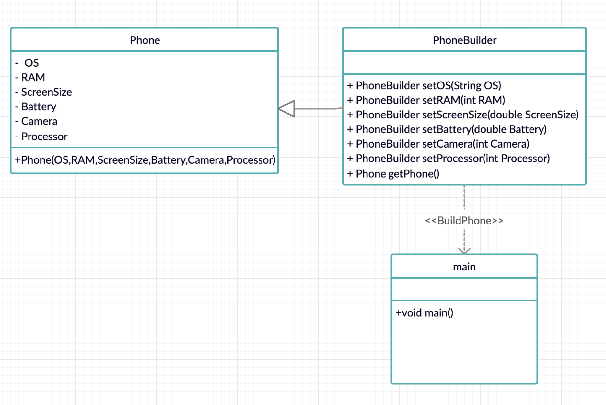

# Builder Pattern

Builder pattern aims to “Separate the construction of a complex object from its representation so that the same construction process can create different representations.” It is used to construct a complex object step by step and the final step will return the object. The process of constructing an object should be generic so that it can be used to create different representations of the same object.

# UML

# Classes
-   Product: [Phone.java](example/Phone.java)
-   Concrete Builder: [PhoneBuilder.java](example/PhoneBuilder.java)
-   Director: [main.java](example/main_shop.java)
-   Builder: A builder is an abstract interface of the Product. It defines all of the steps that must be taken in order to correctly create a product.

# Java Example

In this example we are building a product, which is a Phone. The `Phone` class, also called as Product and contains following properties:
- OS
- RAM
- Screen Size
- Battery
- Camera
- Processor

`PhoneBuilder` class is called as the Concrete Builder. It is used to build the Phone Object step by step by assigning the values to `Phone` class data members.

`main` class is the Director, which calls the `PhoneBuilder` class and builds the `Phone` object  using the Setter functions. It decides how the product `Phone` should be build and in return gets the object.

# Explaination
Builder pattern works like a factory, where a product passes through phases adding a new value or feature to it. 
These phases are implemented by the Concrete Builder.

Here a shop(main) is trying to build a phone for a customer. Customer is looking for only a specific things in the phone such as OS,RAM and Camera. If we do not have a Concrete Builder, we wont be able to call the constructor of the Phone, or have to pass extra parameters as null to build the product. Since we arent passing values for Processor, Battery and Screen Size.
The PhoneBuilder makes it much easier, by calling multiple functions in any sequence from the PhoneBuilder for each parameter to build the final product, and return the complete Phone object.
Addition of new properties in the future can easily be done, without affecting the existing main class. Making the client side code more easy to understand and use.

# Without the Builder Class:
- If we try to build a Phone without the Builder Class, we are forced to obey the contructor of `Phone` class.
- Add/Removal of parameters will result in error or inconsistancy in the `main` class.
- Makes building of `Phone` class more complex and prone to error.

# With the Builder Class: [PhoneBuilder.java](example/PhoneBuilder.java)
- Constructor parameters are reduced, making it more readable.
- Object is instantiated in a complete state.
- Easier to create product.
- Flexible in creating the final object.
- Add/Removal of parameters will not affect the main class.
