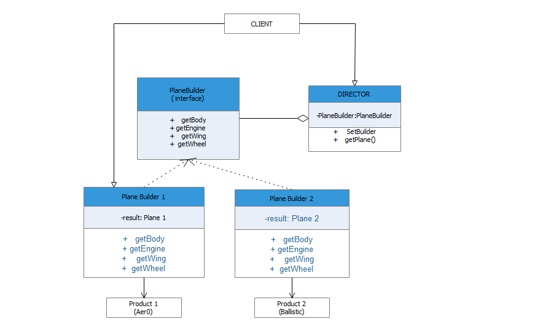

# Builder

Builder design pattern helps in creation of complex objects step by step with a common interface.



## Python example

In the example, [builder.py](builder.py)

 

Planebuilder Interface : This declares the construction steps that are common to

all the plane builders.


Director class: The director class defines the order in which the construction steps are called

                and change the builder required for making a specific product.

                The Director specifies the type of builder based on the requirement of the client.


PlaneBuilder Classes : They are used to construct the products with different implementation.


Product1,Product2 : Plane-1 and Plane-2 are the two types of planes produced using the different planebuilder classes.


Here two different types of planes are build using the common planebuilder interface using series of steps.

The Client must associate one of the builder objects with the director.

Then the director uses that builder object for all further construction. 

## Running the example

```
$ python builder.py

******************************
Plane1
body: Aer0
engine hoorsepower: 100000
wing length: 231 ft.
tire size: 49 in.
Propeller diameter : 200 cm.
******************************
Plane2
body: Ballistic
engine hoorsepower: 120000
wing length: 197 ft.
tire size: 50 in.
Propeller diameter : 320 cm.
******************************
```
