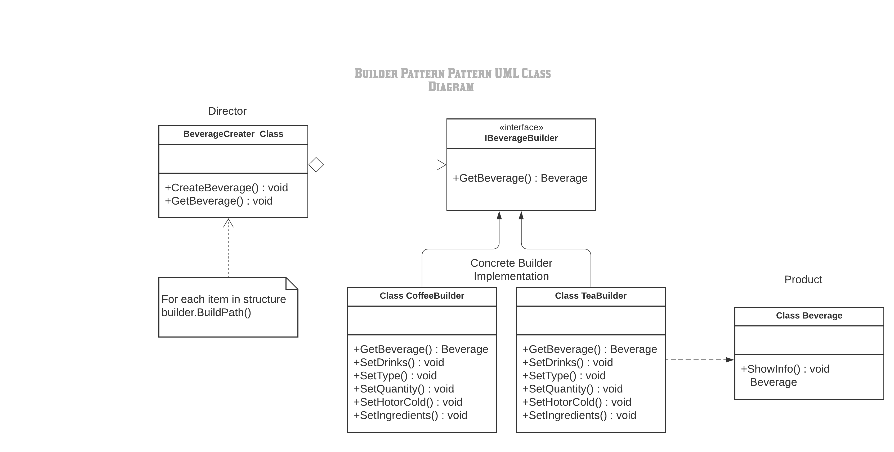
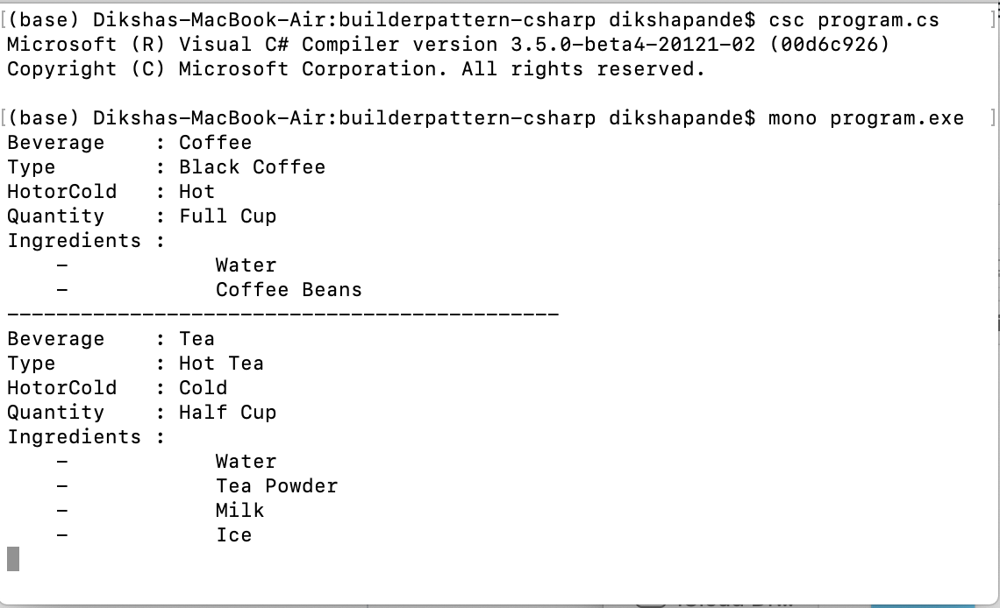

# BuilderPattern

+ The builder pattern is a design pattern designed to provide a flexible solution to various object creation problems in object-oriented programming. The intent of the Builder design pattern is to separate the construction of a complex object from its representation. It is one of the Gang of Four design patterns.

Definition :
The intent of the Builder design pattern is to separate the construction of a complex object from its representation. By doing so the same construction process can create different representations.

The classes and objects participating in this pattern are:

Builder  (BeverageBuilder)
  - specifies an abstract interface for creating parts of a Product object

ConcreteBuilder  (CoffeeBuilder, TeaBuilder)
  - constructs and assembles parts of the product by implementing the Builder interface
  - defines and keeps track of the representation it creates
  - provides an interface for retrieving the product

Director  (BeverageCreater)
  - constructs an object using the Builder interface

Product  (Beverage)
  - represents the complex object under construction. ConcreteBuilder builds the product's internal representation and defines the process by which it's assembled
  - includes classes that define the constituent parts, including interfaces for assembling the parts into the final result

# How to run the program
+ This code contains 1 files Program.cs . I used mono to implement C-sharp codes. First command I used to run is csc Program.cs . The second command I used to run is mono Program.exe. You can run the codes in Visual Studio.

# UML Diagram

# Program Output

