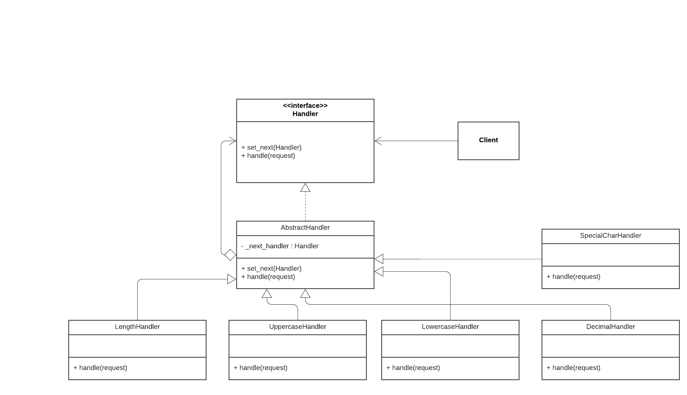

# Chain of Responsibility

This chain of responsibility pattern sends data to an object and if that object can't use it, it sends it to any number of other objects that may be able to use it. It promotes decoupling of requests from handler objects. A system of handlers which will either process or will pass it on. 




## Python example

In the example, [chain-of-responsibility.py](chain-of-responsibility.py)

In the example, we demonstrate the step by step password validation. To have a valid password we follow certain rules
1) Password must be atleast 8 characters long.
2) Password must contain atleast 1 uppercase character
3) Password must contain atleast 1 lowercase character
4) Password must contain atleast 1 decimal digit
5) Password must contain atleast 1 special symbol
If it passes all these criteria then only we consider the password is valid.

The Handler interface:

Describes the signature of a method for handling requests. Decides how the client will pass the request data into the method. 

The Abstract Handler Class:

The default chaining behavior is implemented inside this base handler class.
This class has a field for storing a reference to the next handler in the chain. 

Handler Subclasses :

Each of the handler subclasses : LengthHandler, UppercaseHandler, LowercaseHandler, DecimalHandler, SpecialCharHandler make two decisions when received a request. Whether it will process the request or it will pass the request along the chain.

Client:
The client may either assemble chains on its own or receive pre-built chains from other objects.


## Running the example

```
$ python chain-of-responsibility.py

Chain: LengthCheck > UppercaseCheck > LowercaseCheck > Decimalcheck > Specialcharcheck


Enter the password to check if its valid: Windows@98
Password is valid


Subchain: Decimalcheck > Specialcharcheck


Enter the password to check if its valid: Windows@l
  Need at least one decimal number ['1', '2', '3', '4', '5', '6', '7', '8', '9', '0']
(base) 

```