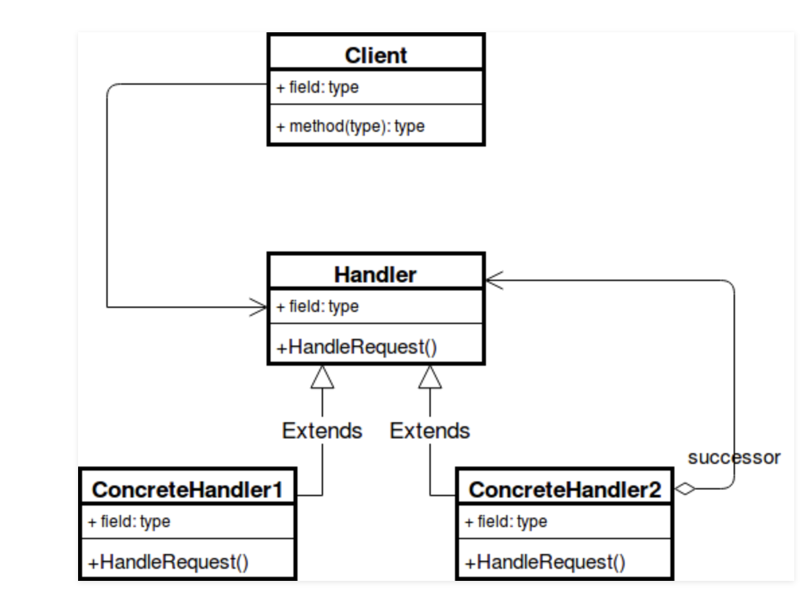
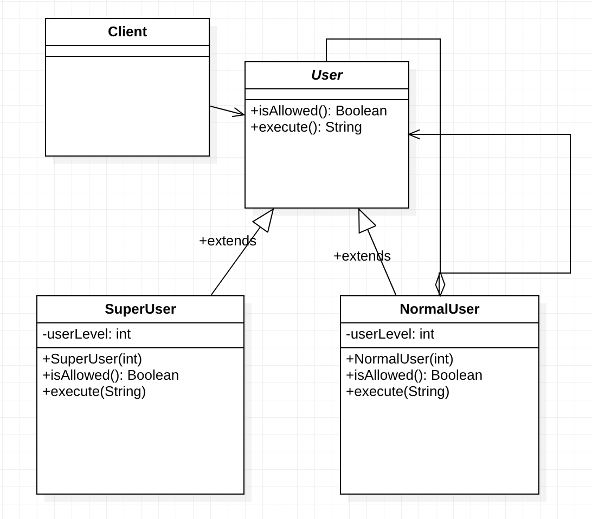

# Chain of Responsibility Design Pattern
Chain of Responsibility is a behavioral design pattern that lets you pass requests along a chain of handlers. Upon receiving a request, each handler decides either to process the request or to pass it to the next handler in the chain.
Chain of responsibility pattern is used to achieve loose coupling in software design where a request from the client is passed to a chain of objects to process them. Later, the object in the chain will decide themselves who will be processing the request and whether the request is required to be sent to the next object in the chain or not.

# Design Pattern UML

# Components of Chain of Responsibility
- Handler [User.java](example/User.java): This can be an interface which will primarily recieve the request and dispatches the request to chain of handlers. It has reference of only first handler in the chain and does not know anything  about rest of the handlers.
- Concrete handlers [NormalUser.java](example/NormalUser.java) and [SuperUser.java](example/SuperUser.java) : These are actual handlers of the request chained in some sequential order.
- Client [Client.java](example/Client.java) : Originator of request and this will access the handler to handle it.

# Java Example
We have an abstract class `User.java` which is the handler, and has functions to validate the user's authorization level, based on which we can execute a DELETE command.
Only a user with authorization level greater than 5 can execute this command.
`SuperUser` and `NormalUser` are concrete implementation of `User` class.

# Java UML

# Uses of Chain of Responsibility
- When you want to decouple a request’s sender and receiver
- Multiple objects, determined at runtime, are candidates to handle a request
- When you don’t want to specify handlers explicitly in your code
- When you want to issue a request to one of several objects without specifying the receiver explicitly.

# Advantages
- To reduce the coupling degree. Decoupling it will request the sender and receiver.
- Simplified object. The object does not need to know the chain structure.
- Enhance flexibility of object assigned duties. By changing the members within the chain or change their order, allow dynamic adding or deleting responsibility.
- Increase the request processing new class of very convenient.

# Disadvantages
- The request must be received not guarantee.
- The performance of the system will be affected, but also in the code debugging is not easy may cause cycle call.
- It may not be easy to observe the characteristics of operation, due to debug.