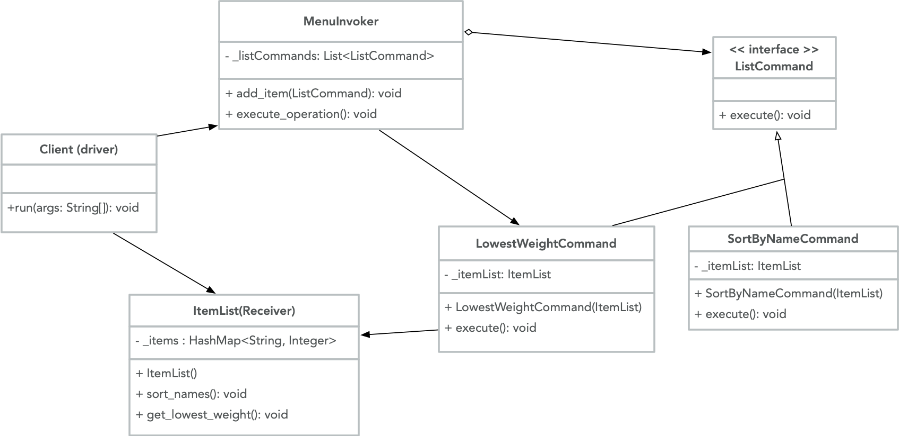

# Command

Command is a behavioral design pattern that turns a request itself into an object. The request can then be transformed as needed by the system. For example, it can be given appropriate parameters and added to an event schedule. The Command pattern allows senders and receivers to be connected without becoming too tightly coupled. The sender doesn't need to know any of the business logic used by the receiver, it simply calls the Command `execute()` method, the method of an associated concrete class gets notified about the request, and the request is added to the the list of commands that are expected to be fulfilled sometime in the future.

A practical use of the Command pattern could be for a menu of list commands. In this example, there is a list of ingredients (items in a recipe), each with a name and weight in grams. There are many ways we may want to manipulate a list, and there could be many other clients wanting to use these same list commands. Here is a UML illustration of the Command design pattern for behaviors associated with `ListCommand`:



## Java example

In Java, Command can be implemented as an abstract class or an interface. Here, the `ListCommand` interface [ListCommand.java](ListCommand.java) is implemented by `LowestWeightCommand` and `SortByNameCommand`, the concrete classes [LowestWeightCommand.java](LowestWeightCommand.java) and [SortByNameCommand.java](SortByNameCommand.java), respectively. Many more concrete classes could be included for executing commands with a list, but these are two common requests that could be made for a list of items. The [Client](driver.java) just needs to set the Receiver [ItemList.java](ItemList.java) and call the Invoker [MenuInvoker.java](MenuInvoker.java). `MenuInvoker` carries out the `execute()` requests, while `ItemList` knows the details for performing the operations for carrying out each request.

### Running the example

After compiling all of the classes using `javac`, a client may add items to the menu and request that they be executed. The client does not need to know the implementation details of each call to [execute_operation](driver.java#L21); the `MenuInvoker` makes sure all requests get executed and the Command pattern ensures the correct method gets called for each command.

```{bash}
$ javac ItemList.java ListCommand.java
$ javac LowestWeightCommand.java SortByNameCommand.java MenuInvoker.java
$ javac driver.java
$ java driver
The ingredient with the lowest weight:
salt (6 grams)
Ingredient items, sorted alphabetically:
baking powder
butter
buttermilk
flour
salt
sugar
```
