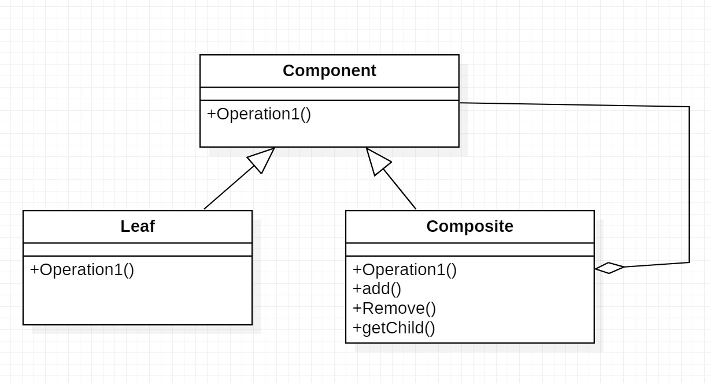
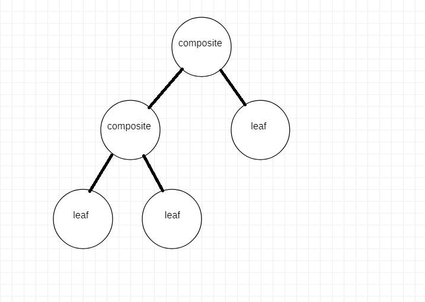

# Composite Design pattern

Composite design pattern is a structural pattern which modifies the structure of an object. This pattern is most suitable in cases where you need to work with objects which form a tree like hierarchy. In that tree, each node/object (except root node) is either composite or leaf node. Implementing the composite pattern lets clients treat individual objects and compositions uniformly.




#### Component
- declares the interface for objects in the composition.
- implements default behavior for the interface common to all classes, as appropriate.
- declares an interface for accessing and managing its child components.
#### Composite
- defines behavior for components having children.
- stores child components.
- implements child-related operations in the Component interface.
#### Leaf
- represents leaf objects in the composition. A leaf has no children.
- defines behavior for primitive objects in the composition.



## JavaScript example

Composite pattern nature is the chapter in books. Chapter contain sections, each of which could be a Chapter. Another example is menus. They have menu items, each of menu item could be a menu in itself.


### Output

```
Chapter One
    Section One
    Section Two
    Section Three
Chapter Two
    Section One
    Section Two
Chapter Three
    Section One
    Section Two
    Section Three
```
