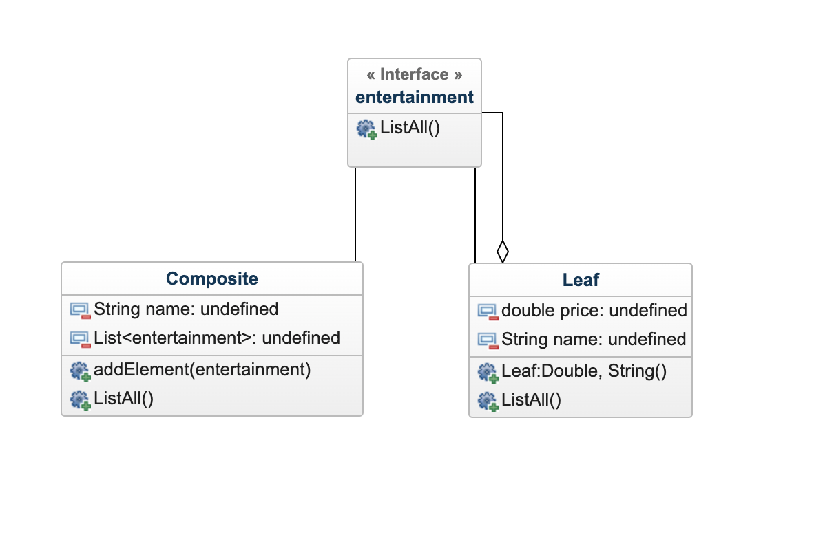
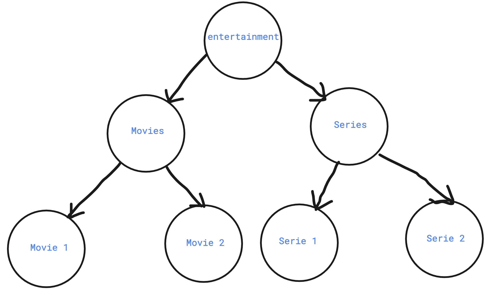

# Composite Design Pattern

Composite pattern is a partitioning design pattern and describes a group of objects that is treated the same way as a single instance of the same type of object. The intent of a composite is to “compose” objects into tree structures to represent part-whole hierarchies. It allows you to have a tree structure and ask each node in the tree structure to perform a task.

# UML Diagram

# Parts of Composite Design Pattern
- Component [entertainment.java](example/entertainment.java) : Component declares the interface for objects in the composition and for accessing and managing its child components. It also implements default behavior for the interface common to all classes as appropriate.

- Leaf [Leaf.java](example/Leaf.java) : Leaf defines behavior for primitive objects in the composition. It represents leaf objects in the composition.

- Composite [Composite.java](example/Composite.java): Composite stores child components and implements child related operations in the component interface.

This pattern creates a tree structure, where Component can be considered as a root node, all the following nodes can be seen as Composite and the leaf nodes as Leaf.
It is important to note, that any operation that is performed on any node, can also be applicable and behaves the same way on every other node in the Composite Design Pattern. Also, each node should corrsenpond to each other, in this case all the nodes represent an `entertainment`.

# Java Example
- In this example we have our Component as `entertainment`, which has `movies` and `series` as the Composite. The name of the movies and series are the Leaf nodes. We can add further levels to the tree structure, by adding genre.
Composite design pattern is used when we need to implement such a tree like hierarchy in our code.

- We have a function ListAll(), which can be used by any node in this structure. When used by the leaf node it shows the `price` and `name` of the leaf. Whereas, it lists all the `series` and `movies` showing the `price` and `names` for the Composite object.

