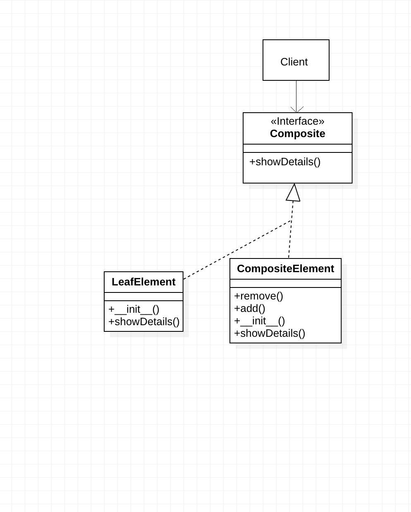

# Composite
The purpose of the Composite Method is to Compose objects into Tree type structures to represent the whole-partial hierarchies.
One of the best solutions to the above-described problem is using Composite Method by working with a common interface that declares a method for calculating the total salary.
We will generally use the Composite Method whenever we have “composites that contain components, each of which could be a composite”.



# Python example

In this case, we can create the `CompositeInterface` class ([Composite.py](Composite.py)),

1. The Composite interface describes operations that are common to both simple and complex elements of the tree.

2. The LeafElement is a basic element of a tree that doesn’t have sub-elements.Usually, leaf components end up doing most of the real work, since they don’t have anyone to delegate the work to.

3. The CompositeElement is an element that has sub-elements: leaves or other containers. A container doesn’t know the concrete classes of its children. It works with all sub-elements only via the component interface.

Upon receiving a request, a container delegates the work to its sub-elements, processes intermediate results and then returns the final result to the client.

4. The Client works with all elements through the component interface. As a result, the client can work in the same way with both simple or complex elements of the tree.

# Output of the program

```
Grocery Store
-Department 1
--Item 1
--Item 2
-Department 2
--Item 4
--Item 4
```