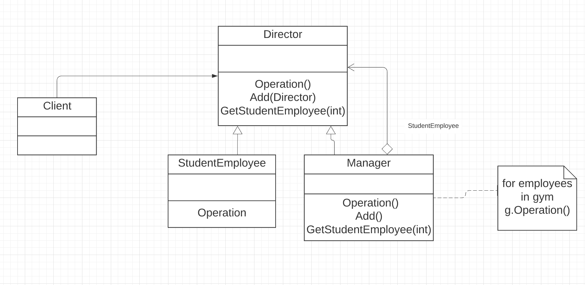

The implementation of composite discussed in the Gym Management mode example demonstrates the composite pattern. 
* This pattern suggests that methods run recursively deep into the hierarchical tree structure until every leaf is covered and then the results are summed up. 
* In this example we consider managerial role of all organization as a composite object in a tree structure and each of these structures is treated as an individual object. 
* The various composite objects here are Director, Manager, Student Lead, Student Employee in the respective hierarchical order. 
* The Manager object would simply return all the student leads and student employees working under him. 

The implemented code for composite can be found [here](composite.rb)  

