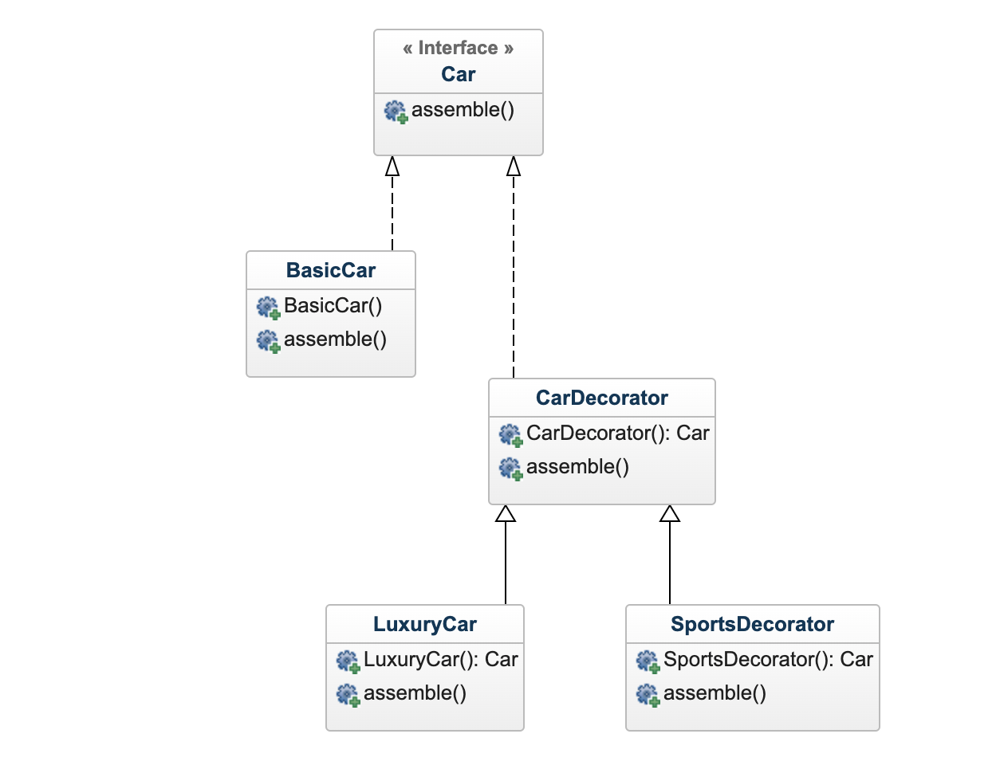

 # Decorator Design Pattern
Decorator design pattern is used to modify the functionality of an object at runtime. At the same time other instances of the same class will not be affected by this, so individual object gets the modified behavior. Decorator design pattern is one of the structural design pattern which uses abstract classes or interface with composition to implement.
We use inheritance or composition to extend the behavior of an object but this is done at compile time and its applicable to all the instances of the class. We can’t add any new functionality of remove any existing behavior at runtime – this is when Decorator pattern comes into picture.

# UML

# Classes
- Component Interface [Car.java](example/Car.java): The interface or abstract class defining the methods that will be implemented. In our case `Car` will be the component interface.
- Component Implementation [BasicCar.java](example/BasicCar.java)– The basic implementation of the component interface. We can have `BasicCar` class as our component implementation.
- Decorator [CarDecorator.java](example/CarDecorator.java)– Decorator class implements the component interface and it has a HAS-A relationship with the component interface. The component variable should be accessible to the child decorator classes, so we will make this variable protected.
- Concrete Decorators [LuxuryCar.java](example/LuxuryCar.java) and [SportsDecorator.java](example/SportsDecorator.java)– Extending the base decorator functionality and modifying the component behavior accordingly. We can have concrete decorator classes as `LuxuryCar` and `SportsDecorator`.

# Java Example
Suppose we want to implement different kinds of cars – we can create interface Car to define the assemble method and then we can have a Basic car, further more we can extend it to Sports car and Luxury Car. 
But if we want to get a car at runtime that has both the features of sports car and luxury car, then the implementation gets complex and if further more we want to specify which features should be added first, it gets even more complex. Now imagine if we have ten different kind of cars, the implementation logic using inheritance and composition will be impossible to manage. To solve this kind of programming situation, we apply decorator pattern in java.

# Important Points
- Decorator design pattern is helpful in providing runtime modification abilities and hence more flexible. Its easy to maintain and extend when the number of choices are more.
- The disadvantage of decorator design pattern is that it uses a lot of similar kind of objects (decorators).
- Decorator pattern is used a lot in Java IO classes, such as FileReader, BufferedReader etc.
- Client program can create different kinds of Object at runtime and they can specify the order of execution too.
