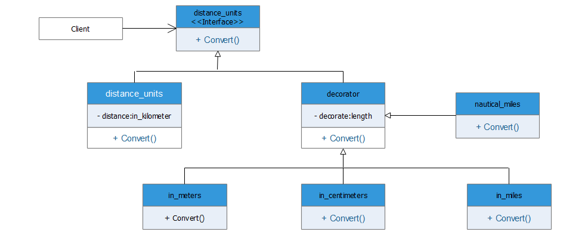

# Decorator:

The Decorator pattern is used to dynamically add a new feature to an
object without changing its implementation. It differs from
inheritance because the new feature is added only to that particular
object instead of the entire class. This pattern uses aggregation and composition instead.



## Python example

Code Example  [decorator.py](decorator.py): The example presented is used to covert kilometers into other units of distance using the decorator design pattern.
         Here the kilometers input is wrapped by different decorators like in_meters, in_miles..etc. to convert them into respective
         distance units. This design pattern add features to our object by decorating it instead of extending and making new subclasses that bloat the code.


### Running the example

```
Enter distance in kilometers:  15
Meter      : 15000 m
Centimeter : 1500000 cm
Miles      : 9.32 mi
Nautical   : 5.03 nmi

```