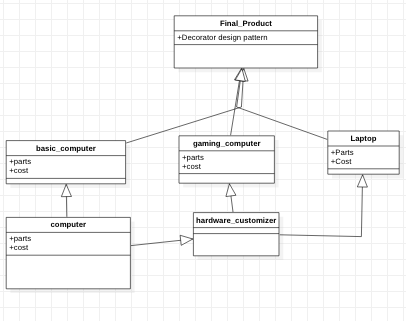

The implementation of the Decorator discussed in the different Car Types model example demonstrates the Decorator Model Pattern.  
* this pattern helps to enhance an object by adding new features to it without changing the class.  
* In this example, the Automobiles interface defines operations that can be altered by the Decorator, Car.  
* The different Car models provide, the default implementation for different types of cars (Basic Car and Sports Car).
* The Luxury car and the Sports car classes inherit from the Basic car class that is the Decorator Class.

The implemented code for Decorator can be found [here](decorator.rb)  

