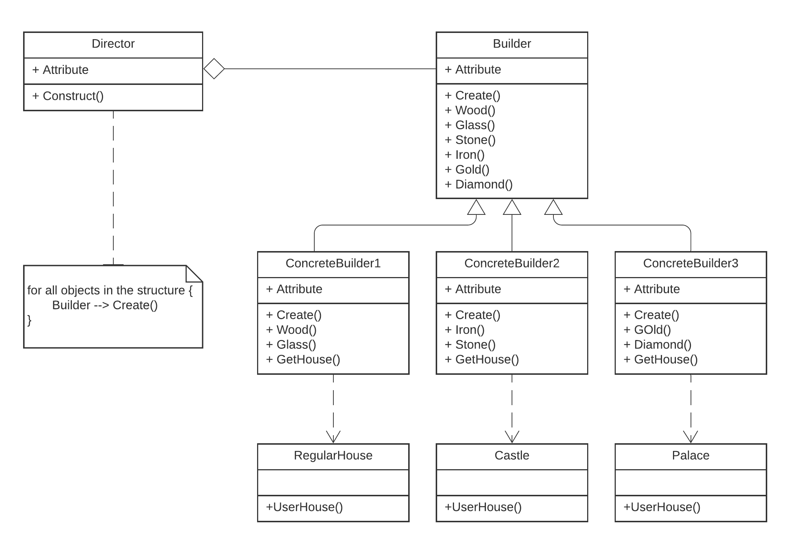

The implementation of builder  discussed in the Construction Management example demonstrates the Builder pattern. 
* The example considered here is about the construction of houses of different design specifications via different clients. 
* We have the entire construction code in the main builder class and for each design we have different classes ConcreteBuilder1,ConcreteBuilder2, ConcreteBuilder3. 
* Each of these classes will only inherit functions of their requirements from the main builder class. 
* The builder pattern suggests that we select the object construction code out of its own class and move it to seperate classes called concrete builders. 
The implemented code for builder can be found [here](builder.rb)

