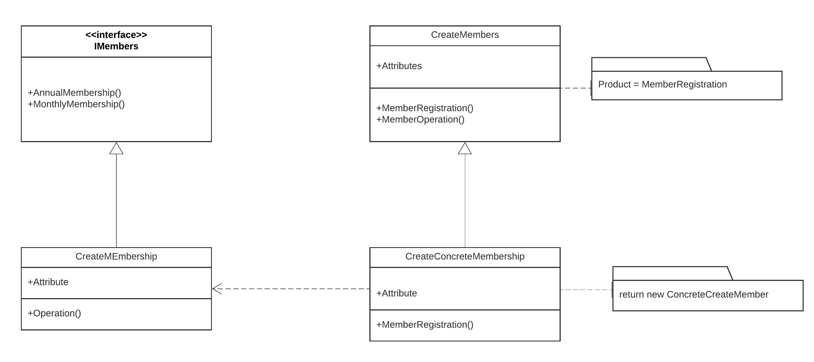

The implementation of factory method discussed in the Gym Membership example demonstrates the Factory method pattern.  
* The factory method pattern implies that we replace direct object construction calls with specific factory method.  
* Objects are still created via new opetator. but, they are being called within the factory method. Factory method returns the finished priducts.
* we have a common interface Members. Each of the factory method returns different types of members and these members have their basis from interface class.  

The implemented code for factory method can be found [here](factory.rb)  
