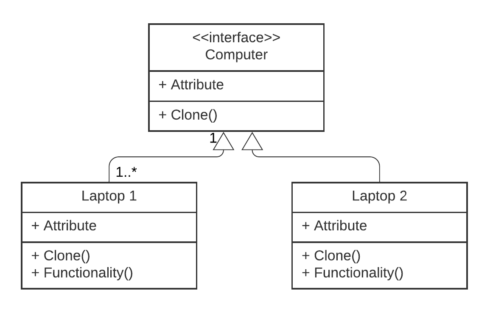

The implementation of prototype discussed in the Laptop model example demonstrates the prototype pattern. 
* This pattern suggests that we copy the exiesing object without making our code dependent on the parent class.  
* The prototype pattern assigns the cloning process to the objects that are being cloned.  
* We have the main interface Computer that helps other objects to clone. The other two classes Laptop1 and Laptop2 clone from the computer class without copying the code.  
* These classes use the clone method to bring the field values of the old object to the new ones.  

The implemented code for prototype can be found [here](prototype.rb)  
