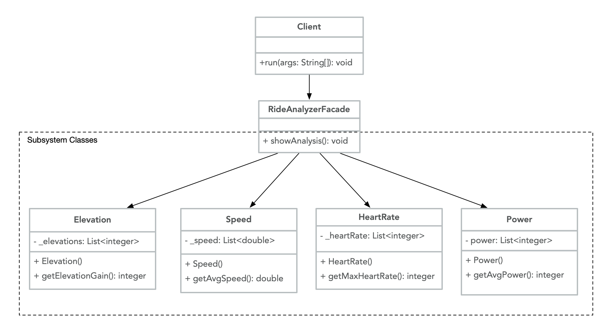

# Facade

Facade is a Structural Design Pattern that uses one object to represent a set of objects. Having a single, unified interface to represent a complex subsystem can be useful for reducing complexity. Often, a system has many subsystem classes that each provide an important functionality, but most clients don't need to know about the details of every subsystem. Thus, a Facade can separate the subsystems from the clients, delegating client requests to the appropriate subsystem as necessary. This looser coupling allows the subsystem components to change with minimal (if any) effect on the clients. The overall purpose of a Facade is to provide a simple interface for a complex set of classes.

A practical use for the Facade pattern could be the ride analysis for a fitness app. Clients don't need to know the implementation details for each complex subsystem class, they just want to see the overall analysis of their latest ride. This example is simplified, but there could be many more classes included in the subsystem that are not mentioned in this example, and each subsystem class could have many more interrelated features. Here is a UML illustration of the Facade Pattern for classes related to a Ride Analyzer:



## Java example

In this case, the `RideAnalyzerFacade` class [RideAnalyzerFacade.java](RideAnalyzerFacade.java) was created as a simple interface for clients to view the data from their ride. A Facade makes it easy for clients to use the application, and ensures that they do not need to know about the creation and operations of each component. The subsystem classes include the `Elevation` class [Elevation.java](Elevation.java), the `HeartRate` class [HeartRate.java](HeartRate.java), the `Power` class [Power.java](Power.java), and the `Speed` class [Speed.java](Speed.java). The Client class [driver.java](driver.java#L18) simply calls the `showAnalysis()` member function of `RideAnalyzerFacade` to get all of the statistics related to the ride.

Each of the subsystem classes in this example have been greatly simplified by using a small list of randomly generated data and one function to represent a component of the information that would need to be calculated for the ride analysis. While each part of the subsystem could have multiple dependencies and a specific order of operations, the Clients would still only need to know about the Facade interface. In this case, `Elevation` returns the sum of elevation gains for each unit of a ride, and `HeartRate` returns the maximum heart rate reached over the course of a ride. `Power` and `Speed` return the average power and speed reached during the ride, respectively. The subsystem classes don't need to know anything about the `RideAnalyzerFacade`, and the Clients don't need to know how to work with each of the subsystem components directly.

### Running the example

After all of the classes have been compiled, a client simply needs to run the [driver.java](driver.java) file to view the analysis of the ride; they do not need to be concerned with the actual functionality of each of the subsystem classes.

```{bash}
$ javac Elevation.java HeartRate.java Power.java Speed.java
$ javac RideAnalyzerFacade.java
$ javac driver.java
$ java driver
Elevation gain: 18 ft
Average Speed: 14.65 mi/hr
Maximum Heart Rate: 180 bpm
Average Power: 148 W
```
