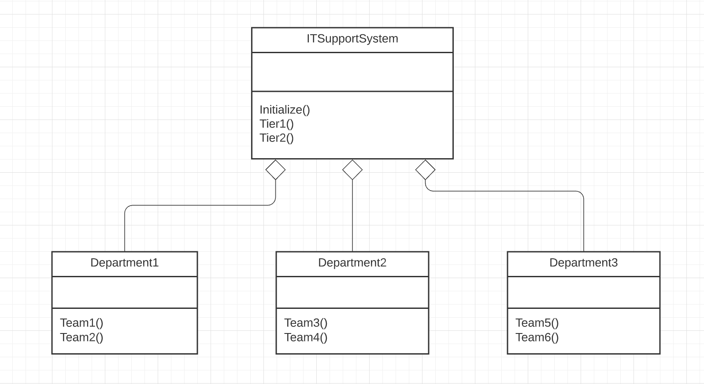

The implementation of Facade design pattern discussed in the Corporate Organization model example demonstrates the Facade pattern.  
* Here, the IT Support System serves all the Departments across the entire university.
* It acts as the Facade system that decreases the overall complexity which the Departments are facing technically.  
* It helps get rid of the unwanted dependencies across all the Departments on campus.  
* All the Departments and their sub teams reach out to the IT Support System's Tier1 and Tier2 to get their technical complexities solved.  

The implemented code for Facade can be found [here](facade.rb)  

