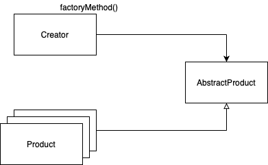
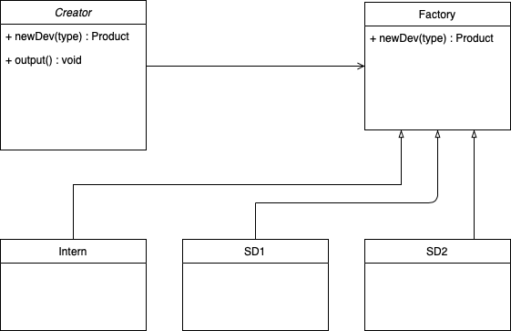
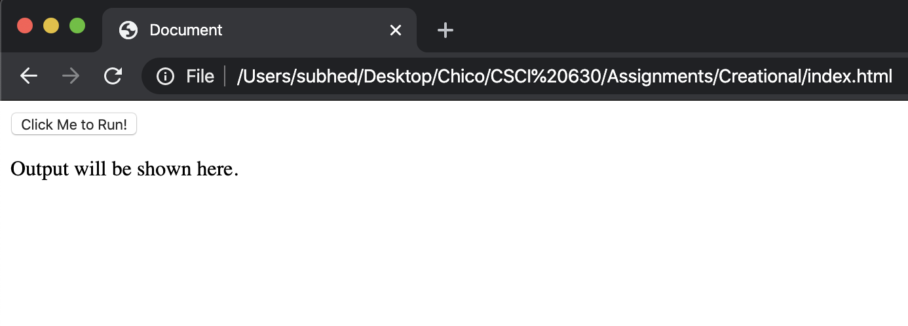
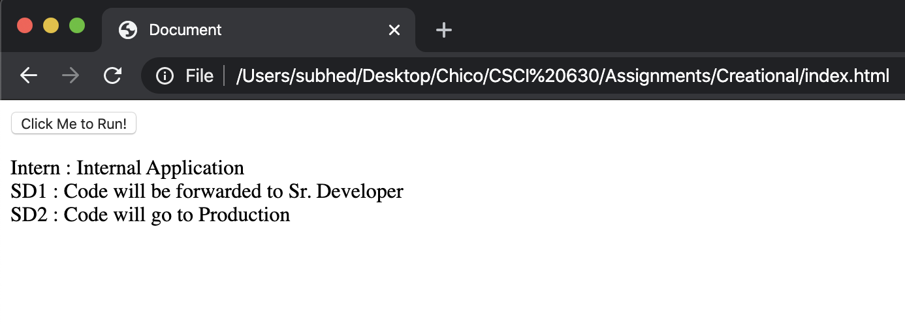

# Factory Method

A Factory Pattern or Factory Method Pattern says that just define an interface or abstract class for creating an object but let the subclasses decide which class to instantiate. In other words, subclasses are responsible to create the instance of the class.

The Factory Method Pattern is also known as Virtual Constructor.

The diagram below shows the working of Factory Method.

## Diagram

## Implementation

1. In this example, we have considered a software company.
2. This program will return the utilization of code in the company according to the designation of the software developer.
3. We have created a concrete product that is the type of developer.
4. A creator class named as Company which will process the request.
5. The functions accept a parameter, which states the kind of developer.
6. The result provides the way the code is going to be used.

## UML Diagram 
Here is a UML illustration of Factory Method, the objects participating in the pattern are:

- Creator : In code it is Company.
- Abstract Product : JavaScript does not consist.
- Concrete Product : Developers as per designations.

## JavaScript example

### Code Links
[Factory.js](factory.js)
[index.html](index.html)

### Running the example

The provided [Factory.js](Factory.js) and [index.html](index.html) 
Open index.html in browser to run the JS.

