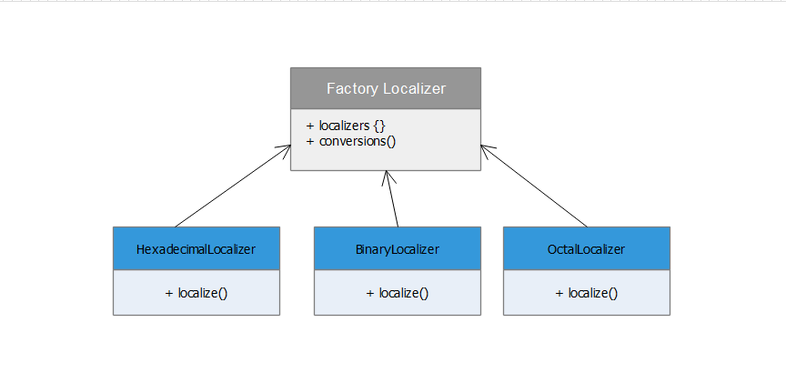

# Factory Method

Factory Method is a creational design pattern that provides an interface for creating objects in a superclass, but allows subclasses to alter the type of objects that will be created.



## Python example

The Factory Method [factory.py](factory.py) pattern suggests that you replace direct object construction calls (using the new operator) with calls to a special factory method. The objects are still created via the new operator, but it’s being called from within the factory method.
Here the method Factory handles the object creation. Instead of creating objects in the main method we will creating classes in the Factory method. This allows us to add conversions like decimal to octal in functionality without disturbing the existing client code.

## Running the example

```
$ python factory.py

Hexadecimal of 7 is 7
Binary of 7 is 111
Octal of 7 is 7
Hexadecimal of 73 is 49
Binary of 73 is 1001001
Octal of 73 is 111
Hexadecimal of 178 is b2
Binary of 178 is 10110010
Octal of 178 is 262

```