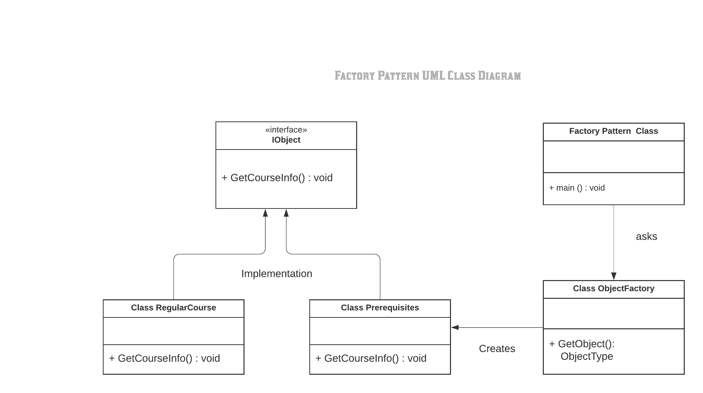

#Factory Method Pattern

In class-based programming, the factory method pattern is a creational pattern that uses factory methods to deal with the problem of creating objects without having to specify the exact class of the object that will be created. This is done by creating objects by calling a factory method—either specified in an interface and implemented by child classes, or implemented in a base class and optionally overridden by derived classes—rather than by calling a constructor.

Definition
"Define an interface for creating an object, but let subclasses decide which class to instantiate. The Factory method lets a class defer instantiation it uses to subclasses." (Gang Of Four)

Creating an object often requires complex processes not appropriate to include within a composing object. The object's creation may lead to a significant duplication of code, may require information not accessible to the composing object, may not provide a sufficient level of abstraction, or may otherwise not be part of the composing object's concerns. The factory method design pattern handles these problems by defining a separate method for creating the objects, which subclasses can then override to specify the derived type of product that will be created.

The factory method pattern relies on inheritance, as object creation is delegated to subclasses that implement the factory method to create objects.

The classes and objects participating in this pattern are:

IObject (<<interface>>)
 - interface called IObject and two implementations called RegularCourse and PreRequisites.
 - Based on the object type passed into the Factory object, we are returning the original concrete object as the interface IObject.

ObjectFactory
  - It creates the object of the class through interfaces but on the other hand, it also lets the subclass decide which class is instantiated.
  - classes to be instantiated are RegularCourse and PreRequisites classes.

