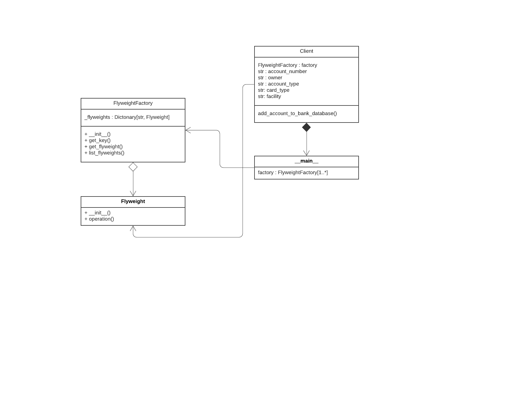

# Flyweight

Flyweight design pattern is a structural design pattern and  primarily used to reduce the number of objects created. Flyweight pattern tries to reuse already existing similar kind objects by storing them and creates new object when no matching object is found.



## Python example

In the example, [flyweight.py](flyweight.py)

Intrinsic State:

The Flyweight stores a common portion of the state that belongs to multiple real business entities. The Flyweight accepts the rest of the state (extrinsic state, unique for each entity) via its method  parameters.

FlyweightFactory :

The Flyweight Factory creates and manages the Flyweight objects. It ensures that flyweights are shared correctly.


Extrinsic State :

add_account_to_bank_database is a client code that either stores or calculates extrinsic state and passes it. 

In the example one could clearly see that we are reusing the existing objects and if some object are not present already, then only we are creating the new objects.

## Running the example

```
$ python flyweight.py


FlyweightFactory: I have 4 flyweights:
Checking Account_Credit Card_Net Banking
Debit Card_Mobile Banking_Savings Account
Credit Card_Interest Bearing Checking Accounts_Net Banking
Brokerage_Accounts_Credit_Card_Mobile_Banking

Client: Adding a customer account to database.
FlyweightFactory: Reusing existing flyweight.
Flyweight: Displaying shared (["Checking Account", "Credit Card", "Net Banking"]) and unique (["010424454", "Nomaan Shaikh"]) state.

Client: Adding a customer account to database.
FlyweightFactory: Can't find a flyweight, creating new one.
Flyweight: Displaying shared (["Investment Retirement Accounts", "Debit Card", "Net Banking"]) and unique (["010424459", "Jayesh Sathe"]) state.

FlyweightFactory: I have 5 flyweights:
Checking Account_Credit Card_Net Banking
Debit Card_Mobile Banking_Savings Account
Credit Card_Interest Bearing Checking Accounts_Net Banking
Brokerage_Accounts_Credit_Card_Mobile_Banking
Debit Card_Investment Retirement Accounts_Net Banking

```