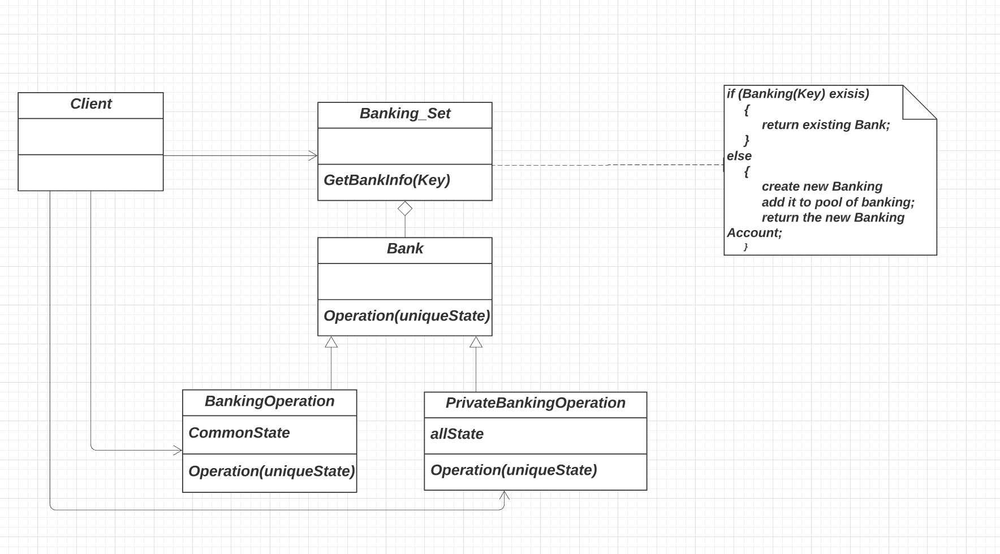

The implementation of flyweight discussed in the Banking model example demonstrates the flyweight pattern. 
* This pattern suggests that large amount of objects can fit into the available amount of RAM, by placing all the common parts in all objects separately so that these parts are not redundantly placed in each object. 
* We are considering an example of a Banking system class that has different operations. 
* We have a Banking Operation class that inherits from the Bank base class. This acts as a common part that is accessible by other objects. 
* Banking operation is the class that has all the intrinsic parts of all objects. 
* Different types of back opening accounts are accessed using the unique objects and the intrinsic and extrinsic features are called. 

The implemented code for flyweight can be found [here](flyweight.rb)  

