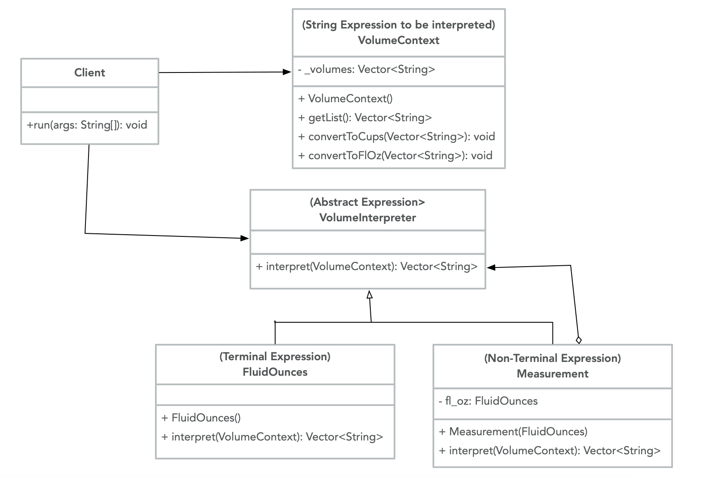

# Interpreter

Interpreter is a behavioral design pattern that uses the grammar of a language to interpret sentences in that language. In this sense, a language can be any recurring problem in a well-defined domain. There is an Interpreter that follows the corresponding grammar rules and makes the problem solvable using an object-oriented design. Interpreter is best for a relatively simple grammar, so if the grammar is too complex, a different technique may be more appropriate.

A practical use for the Interpreter pattern could be for converting the amounts of ingredients in a recipe. In the US, volume can be measured in gallons, quarts, pints, cups, tablespoons, and teaspoons. If you want to be able to compare these values, it would be useful to have the values in the same form of measurement. This interpreter finds the equivalent value in cups before interpreting the value in fluid ounces (the unit of measurement desired). Here is a UML illustration of the Interpreter design pattern for behaviors associated with `VolumeInterpreter`:



## Java example

The Interpreter pattern starts with an abstract expression. In this case, we create the `VolumeInterpreter` interface [VolumeInterpreter.java](VolumeInterpreter.java) with an `interpret()` method that takes in a `VolumeContext` (a vector of strings that we are wanting to interpret). [VolumeContext.java](VolumeContext.java) includes methods to interpret the vector of strings; however, the Client does not need to know the details of the interpretation, it just calls [interpret()](driver.java#L25). The actual interpretation happens in two steps. First, the context goes through the Non-Terminal expression `Measurement`. In [Measurement.java](Measurement.java), the context is converted to equivalent measurements in cups, so all of the forms of measurement are uniform. Then the context is passed to the Terminal expression `FluidOunces`. In [FluidOunces.java](FluidOunces.java), the context gets interpreted for one more step -- the list of values is converted to equivalent values in fluid ounces. The terminal expression is the final step of the interpretation, so it returns the context to the Client in [driver.java](driver.java).

### Running the example

After compiling all of the classes using `javac`, a client can get the list of items and see the result before and after `interpret()`. The interpretation happens in multiple steps (implemented by `Measurement` and `FluidOunces`), but the client only needs to make one request for interpretation in order to see the result.

```{bash}
$ javac VolumeInterpreter.java VolumeContext.java
$ javac FluidOunces.java Measurement.java
$ javac driver.java
$ java driver
Before interpretation:
2 gallon
0.5 gallon
1 quart
0.75 quart
3 pint
0.5 pint
1.5 cup
0.75 cup
1 tablespoon
0.5 tablespoon
4 teaspoon
1 teaspoon
After interpretation:
256.000 fl oz
64.000 fl oz
32.000 fl oz
24.000 fl oz
48.000 fl oz
8.000 fl oz
12.000 fl oz
6.000 fl oz
0.500 fl oz
0.250 fl oz
0.667 fl oz
0.167 fl oz
```
