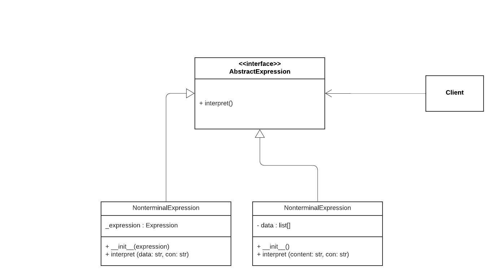

# Interpreter

The interpreter pattern is normally ignored. It is used to conver one representation of data into another. It consists of following components.

1) AbstractExpression: Declares an interpret method in an abstract interface class.
2) TerminalExpression: It implements interpret() operation for terminal expression
3) NonterminalExpression : It implements the interpret() operation for all nonterminal expressions.



## Python example

In the example, [interpreter.py](interpreter.py)

the program does the operations of finding palindrome of a string, vowel count in the string and hash of the given string using Terminal and Nonterminal expressions declared in then program.

## Running the example

```
$ python interpreter.py

String is Palindrome
{'a': 2, 'e': 0, 'i': 0, 'o': 0, 'u': 0}
026486846129ede4c959b03b699cf53e1dc92ab0953f0d8b7d47ce90851f5ba0

```

