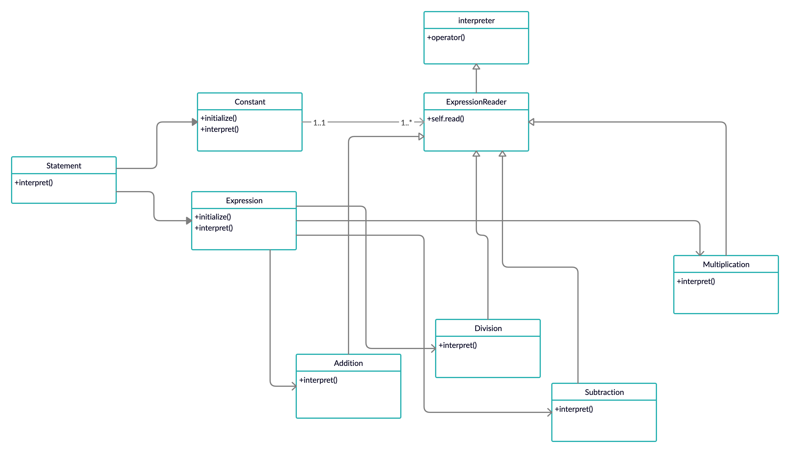

# Interpreter

The Interpreter pattern discusses: defining a domain language (i.e. problem characterization) as a simple language grammar, representing domain rules as language sentences, and interpreting these sentences to solve the problem. The pattern uses a class to represent each grammar rule. And since grammars are usually hierarchical in structure, an inheritance hierarchy of rule classes maps nicely.

An abstract base class specifies the method interpret(). Each concrete subclass implements interpret() by accepting (as an argument) the current state of the language stream, and adding its contribution to the problem solving process.



## Running the Example

To execute the program from command line, please use the following command:

```{bash}
% ruby interpreter.rb
1341 - 213 = 1128
3412 + 232 = 3644
15 / 3 = 5
23 * 12 = 276
```
