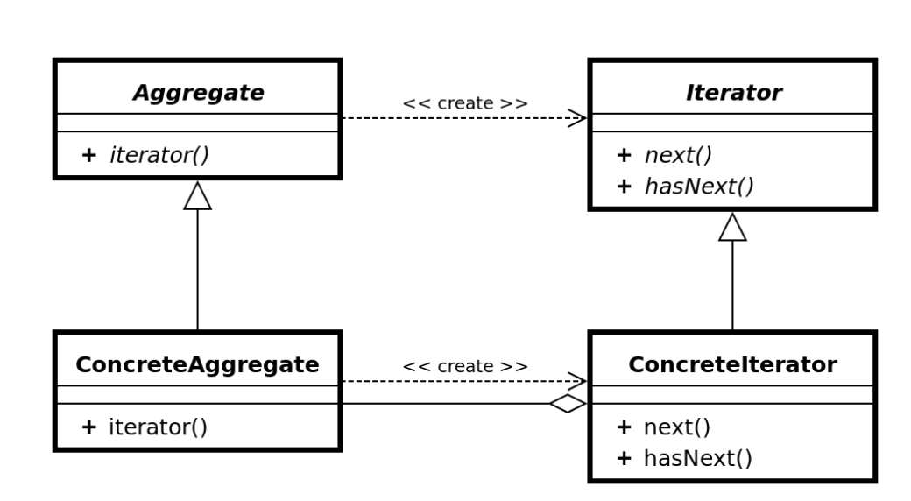
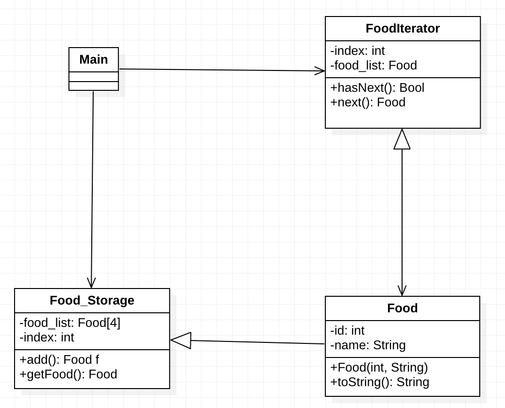

# Iterator Design Pattern
According to GoF definition, an iterator pattern provides a way to access the elements of an aggregate object sequentially without exposing its underlying representation. It is behavioral design pattern.
As name implies, iterator helps in traversing the collection of objects in a defined manner which is useful the client applications. During iteration, client programs can perform various other operations on the elements as per requirements.

# Use of Iterator Design Pattern
Every programming language support some data structures like list or maps, which are used to store a group of related objects. In Java, we have List, Map and Set interfaces and their implementations such as ArrayList and HashMap.

A collection is only useful when it’s provides a way to access its elements without exposing its internal structure. The iterators bear this responsibility.

So any time, we have collection of objects and clients need a way to iterate over each collection elements in some proper sequence, we must use iterator pattern to design the solution.

- The iterator pattern allow us to design a collection iterator in such a way that we are able to access elements of a collection without exposing the internal structure of elements or collection itself.
- Iterator supports multiple simultaneous traversals of a collection from start to end in forward, backward or both directions.
- Iterator provide a uniform interface for traversing different collection types transparently.

# UML for the pattern

# UML for the JAVA Example

# Iterator Design Pattern Important Points
- Iterator pattern is useful when you want to provide a standard way to iterate over a collection and hide the implementation logic from client program.
- The logic for iteration is embedded in the collection itself and it helps client program to iterate over them easily.
