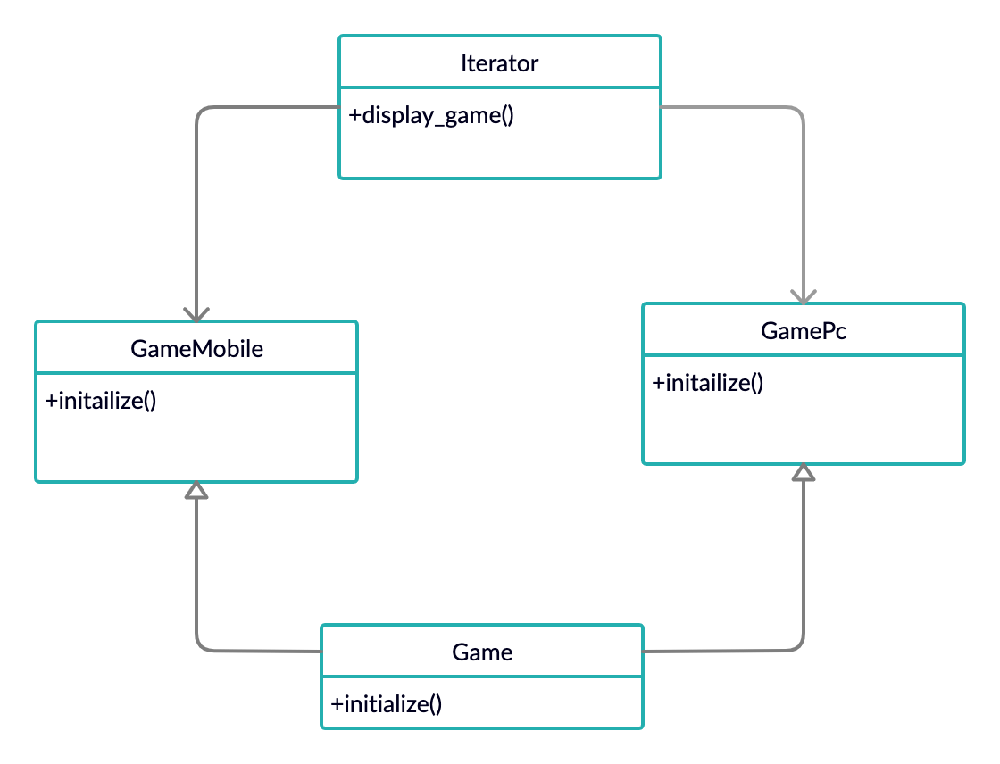

# Iterator

Iterator Pattern is a relatively simple and frequently used design pattern. There are a lot of data structures/collections available in every language. Each collection must provide an iterator that lets it iterate through its objects. However while doing so it should make sure that it does not expose its implementation.



## Running the Example

To execute the program from command line, please use the following command:

```{bash}
% ruby iterator.rb 
Games on Mobile:
game: Call_of_Duty -- size: 2GB -- popularity: 100%
game: Fortnite -- size: 3GB -- popularity: 96%
game: PokemonGo -- size: 1GB -- popularity: 80%

Games on PC:
game: ApexLegends -- size: 24GB -- popularity: 100%
game: Overwatch -- size: 32GB -- popularity: 97%
game: RocketLeague -- size: 8GB -- popularity: 73%
```
