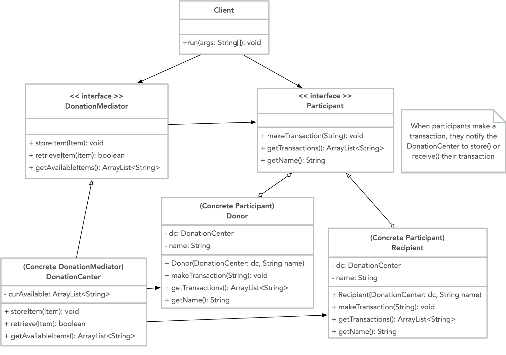

# Mediator

Mediator is a behavioral design pattern that promotes loose coupling by keeping objects from referring to each other explicitly. The Mediator acts as a link for communication between a set of objects, keeping them from becoming too interconnected and helping them interact with each other more independently. A practical use of the Mediator pattern is for a Donation Center. It is much more efficient to have one central mediator for all participants to interact with, instead of trying to connect each donor (and the items they are donating) with the recipient (and the specific items they are requesting). Here is a UML illustration of a `DonationMediator` class:



## Java example

In this case, we create a `DonationMediator` as an interface [DonationMediator.java](DonationMediator.java), with the corresponding concrete `DonationCenter` implementation [DonationCenter.java](DonationCenter.java). The Mediator provides a central means of communication for all Participants who want to either make or receive donations. `Participant` is an interface [Participant.java](Participant.java) for outlining how people communicate and interact with the `DonationCenter`. The `DonationCenter` maintains a list of available items, knows which items are available at all times, and facilitates the coordination of donations, so that items that have been donated go to the Recipients who need them. [Donor.java](Donor.java) and [Recipient.java](Recipient.java) are concrete implementations of `Participant`. While any `Donor` or `Recipient` could communicate with each other directly, channeling all communication and transactions through the `DonationMediator` is more efficient and ensures that there is no tight coupling between Participants. Whenever a transaction is made by a `Donor` or `Participant`, the `DonationCenter` is [notified that an item has been donated](Donor.java#L21) or [a request for an item has been made](Recipient.java#L21).

### Running the example

After compiling all of the classes using `javac`, the client code simply shows the transactions that have been executed. All Participants call the same `makeTransactions()` method, and the actual transactions happen using the Mediator pattern, with the appropriate `Participant` classes and the `DonationCenter`.

```{bash}
$ javac DonationMediator.java DonationCenter.java
$ javac Participant.java Donor.java Recipient.java
$ javac driver.java
$ java driver
Don donated: [food, clothes]
Donna donated: [books, furniture, jewelry]
Available Donations: [food, clothes, books, furniture, jewelry]
Ree received: [food, books]
Rick requested 'appliance', but it was unavailable
Rick received: [furniture]
Available Donations: [clothes, jewelry]
```
