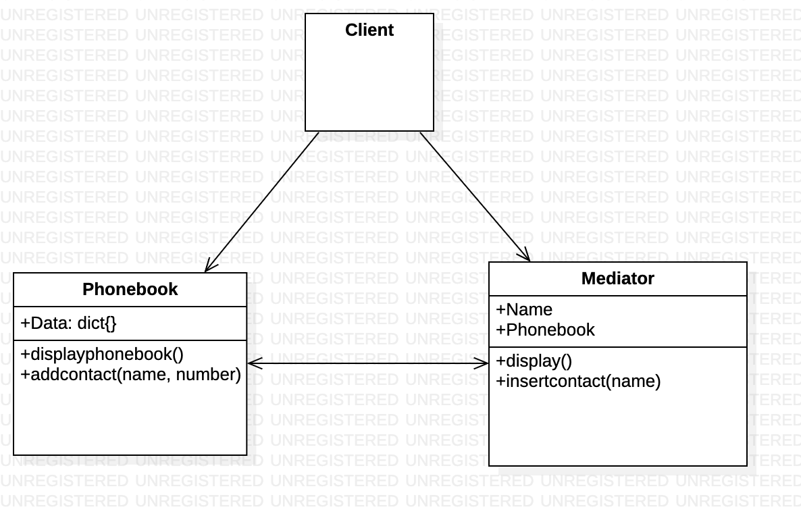

# Mediator 

Mediator Method is a Behavioral Design Pattern which allows us to reduce the unordered dependencies between the objects. In a mediator environment, objects take the help of mediator objects to communicate with each other. It reduces coupling by reducing the dependencies between communicating objects. The mediator works as a router between objects and it can have it’s own logic to provide a way of communication.



# Python example

In this case, we can create the `Mediator` class ([Mediator.py](mediator.py)),

1. Client should make a request to the phonebook by calling mediator which is user class.

2. PhoneBook shows the output to the client through mediator ehich is user.

# Output of the program
```
Devam : 530-897-556
Chetan : 536-887-556
Gopal : 533-897-256
Contact added in the database
Contact added in the database
Contact added in the database
Following is the contact list for the user:  User 2
Nomaan : 511-897-556
Subhed : 535-887-556
Aadhar : 887-897-256
```