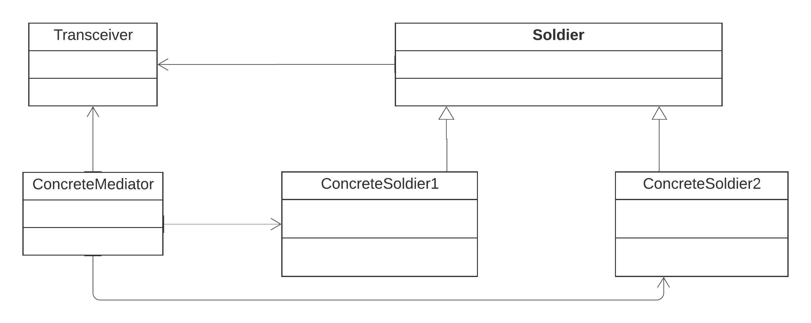

The implementation of Mediator discussed in the Remote Communication example demonstrates the Mediator pattern. 
* This pattern helps maintain the reduced dependency between components. 
* In difficult situations, where other components cannot properly interact with each mediator comes into picture. 
* We are considering an example of a transciever in a battlefield which helps soldiers Communicate with each other. 
* The soldiers are loosely coupled components that are independent and only directly depend on the transciever to help them communicate with each other. 
The implemented code for builder can be found [here](mediator.rb)

