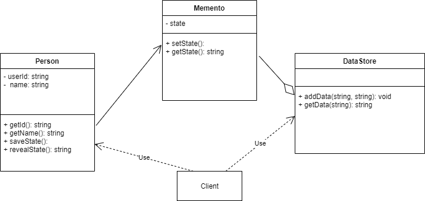

# Memento pattern

## Definition
  Memento pattern provides temporary storage and restoration of an object.

## Implementation
1) The example displays Person class with username and userid attributes.
2) DataStore class is used for storing the state of the user.
3) JSON Stringify method is used to store the object data and restoration.
4) In implementation user is created. User data is stored using saveData() method which is Memento representation.
5) Userid is modified to another string.
6) for restoring the data, revealData() is called which takes the userId saved earlier and reveals the userId which states that
Memento pattern is established. 
7) The interface shown in UML is not used in this example due to Javascript restrictions.

## Links
[Person.js](./Person.js)
[DataStore.js](./DataStore.js)
[app.js](./app.js)

## UML Diagram:

## Advantages
1) To preserve the object state so that any minor changes could be done to the data object id necessary.

