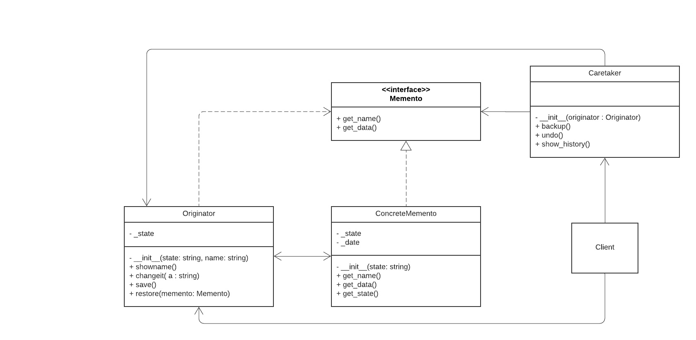

# Memento

Memento design pattern gives a way to store previous states of an Object easily. The Memento design pattern has 3 main components.

1) Memento : The basic object that is stored in different state
2) Originator : Sets and Gets values from currently targeted Memento. Creates new Mementos and assigns current values to them.
3) Caretaker : Holds a list that contains all previous versions of the Memento. It can store and retrieve stored Mementos.



## Python example

In the example, [memento.py](memento.py)

The program simulates the text editor application. The program allows to create new documents, edit those document, undo to the previous version of same document and save the multiple documents.


In the example the client code maintains the list of originators and caretakers to maintain there state, retreive the objects at any time and perform operations on those to simulate the functionality of edit, undo and the save operations.


## Running the example


```
python memento.py
Welcome to Editor, Create, Edit, Save and Undo your Work 
Menu: 
1 Create new document
2 Edit existing document
3 Exit
Please enter your choise: 1
Please enter name for the document: Doc1

 Please start typing here and press enter to save the document: 
This is my first document
Originator: Document Saved: This is my first document

Caretaker: Saving Originator's state...
1 Overwrite existing document
2 Show previous changes in the document
3 Undo to previous version
4 Save and Exit
Enter your choise: 1
Please start typing here and press enter to save the document: I changed my first document
Originator: Document Overwritten.
Originator: Updated Document: I changed my first document

Caretaker: Saving Originator's state...
1 Overwrite existing document
2 Show previous changes in the document
3 Undo to previous version
4 Save and Exit
Enter your choise: 1
Please start typing here and press enter to save the document: I again changed my first document
Originator: Document Overwritten.
Originator: Updated Document: I again changed my first document

Caretaker: Saving Originator's state...
1 Overwrite existing document
2 Show previous changes in the document
3 Undo to previous version
4 Save and Exit
Enter your choise: 2
Caretaker: Here's the list of mementos:
2020-05-03 19:54:13 / (This is m...)
2020-05-03 19:54:26 / (I changed...)
2020-05-03 19:54:40 / (I again c...)
1 Overwrite existing document
2 Show previous changes in the document
3 Undo to previous version
4 Save and Exit
Enter your choise: 3
Caretaker: Restoring state to: 2020-05-03 19:54:40 / (I again c...)
Originator: My state has changed to: I again changed my first document
1 Overwrite existing document
2 Show previous changes in the document
3 Undo to previous version
4 Save and Exit
Enter your choise: 3
Caretaker: Restoring state to: 2020-05-03 19:54:26 / (I changed...)
Originator: My state has changed to: I changed my first document
1 Overwrite existing document
2 Show previous changes in the document
3 Undo to previous version
4 Save and Exit
Enter your choise: 4
Menu: 
1 Create new document
2 Edit existing document
3 Exit
Please enter your choise: 1
Please enter name for the document: Doc2

 Please start typing here and press enter to save the document: 
This is my second document
Originator: Document Saved: This is my second document

Caretaker: Saving Originator's state...
1 Overwrite existing document
2 Show previous changes in the document
3 Undo to previous version
4 Save and Exit
Enter your choise: 1
Please start typing here and press enter to save the document: I changed my second document
Originator: Document Overwritten.
Originator: Updated Document: I changed my second document

Caretaker: Saving Originator's state...
1 Overwrite existing document
2 Show previous changes in the document
3 Undo to previous version
4 Save and Exit
Enter your choise: 2
Caretaker: Here's the list of mementos:
2020-05-03 19:55:31 / (This is m...)
2020-05-03 19:55:47 / (I changed...)
1 Overwrite existing document
2 Show previous changes in the document
3 Undo to previous version
4 Save and Exit
Enter your choise: 4
Menu: 
1 Create new document
2 Edit existing document
3 Exit
Please enter your choise: 2
Choose from below list documents to edit: 
1 Doc1
1 Doc2
Enter your choise: 2
1 Overwrite existing document
2 Show previous changes in the document
3 Undo to previous version
4 Save and Exit
Enter your choise: 1
Please start typing here and press enter to save the document: I again changed my document
Originator: Document Overwritten.
Originator: Updated Document: I again changed my document

Caretaker: Saving Originator's state...
1 Overwrite existing document
2 Show previous changes in the document
3 Undo to previous version
4 Save and Exit
Enter your choise: 2
Caretaker: Here's the list of mementos:
2020-05-03 19:55:31 / (This is m...)
2020-05-03 19:55:47 / (I changed...)
2020-05-03 19:56:37 / (I again c...)
1 Overwrite existing document
2 Show previous changes in the document
3 Undo to previous version
4 Save and Exit
Enter your choise: 3
Caretaker: Restoring state to: 2020-05-03 19:56:37 / (I again c...)
Originator: My state has changed to: I again changed my document
1 Overwrite existing document
2 Show previous changes in the document
3 Undo to previous version
4 Save and Exit
Enter your choise: 4
Menu: 
1 Create new document
2 Edit existing document
3 Exit
Please enter your choise: 3

```