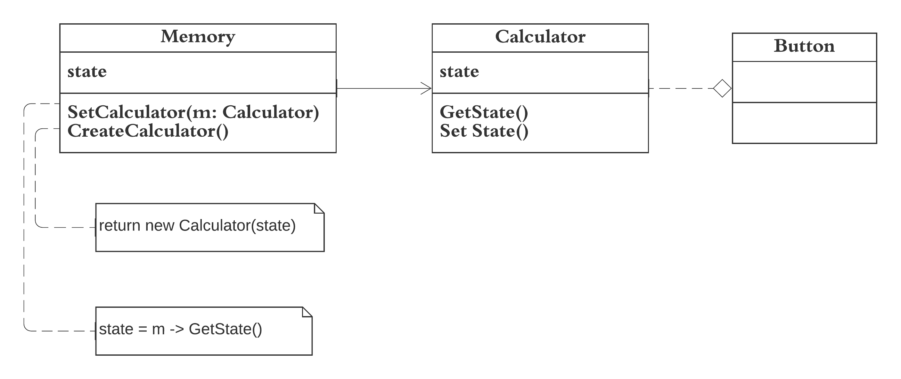

The implementation of Memento discussed in the Calculator example demonstrates the Memento pattern. 
* Memento is used to restore the state of an object to a previous state.  
* The memento pattern lets us make full copies of an object’s state, including private fields and store them separately from the object.
* The memento pattern is implemented with three objects, the originator, a caretaker and memento.
* Example: Calculator - revisit all the calculations in memory with simple button press.
The implemented code for builder can be found [here](memento.rb)

