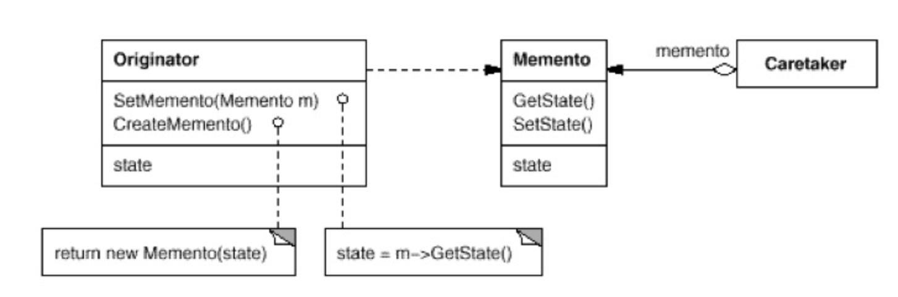
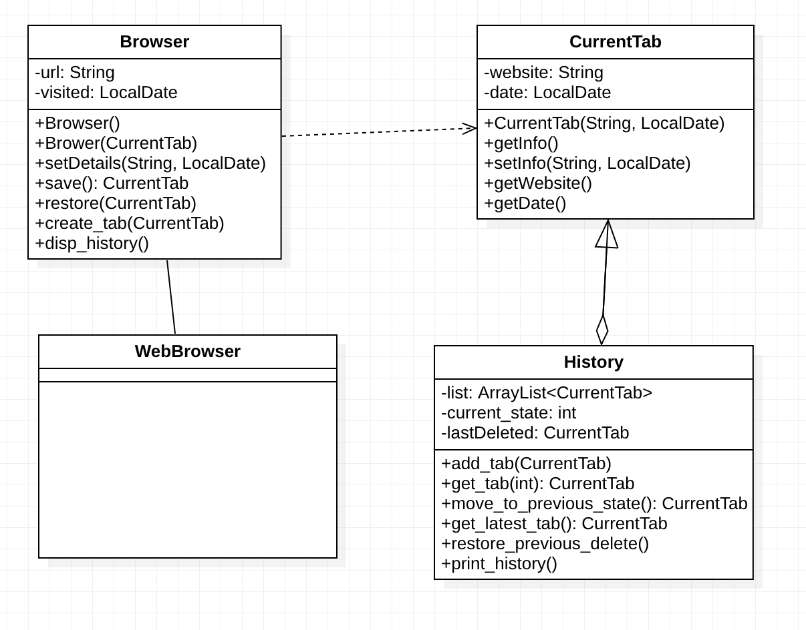

# Momento Design Pattern
Memento is a behavioral design pattern that lets you save and restore the previous state of an object without revealing the details of its implementation.
Memento pattern uses three actor classes. Memento contains state of an object to be restored. Originator creates and stores states in Memento objects and Caretaker object is responsible to restore object state from Memento. We have created classes Memento, Originator and CareTaker.

# Design Pattern UML

- Originator: The object for which the state is to be saved. It creates the memento and uses it in future to undo.
- Momento : The object that is going to maintain the state of originator.
- Caretaker : The object that keeps track of multiple memento.

# Java Example
In the example we have a Basic Web Browser. Which is implemntaing the Momento Design Pattern to store, delete and restore browser history.
- [Browser.java](example/Browser.java) is the Originator which Create new Browser Tabs and stores the latest active tab in the browser.
- [CurrentTab.java](example/CurrentTab.java) is the Momento and stores and maintains the current tab information.
- [History.java](example/History.java) is the Caretaker which stores the Browser Tabs history in an ArrayList and a pointer to the last entry.
- [WebBrowser.java](example/WebBrowser.java) is the Client which runs the Browser.

# Example UML

# Use of Design Pattern
- Need an undo and restore mechanism.
- Database rollback. To be able to rollback, have the Originator create a snapshot (memento) before performing an operation and thus in case of failure, the memento object would be used to restore the Originator to its previous state.
- Want to simplify Originator code so it does not need to keep track of its previous state by moving such responsibility to the Caretaker code.