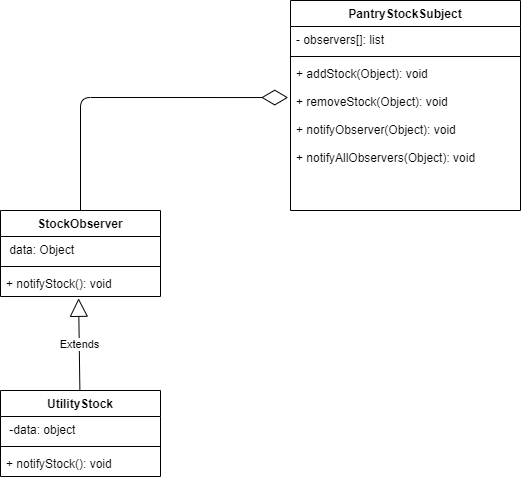

# Observer pattern

## Definition
  The Observer pattern offers a subscription model in which objects subscribe to an event and get notified when the event occurs. 

## Implementation
1) The example reflects scenario for handling pantry food items which is a service for students.
2) It consists of three classes, PantryStockSubject, StockObserver, UtilityStock. 
3) PantryStockSubject class serves as subject which has functionalities of adding stock, removing stock, notifying observers.
4) StockObserver forms the base class for sending and receiving the notification event from PantryStockSubject example : notifyStock().
5) The PantryStockSubject class methods make use of common list attribute to collect the objects sent by StockObserver for adding food items.
6) The UtilityStock class serves as child class for receiving the events from StockObserver class. The functionality for which is not provided in this example.
7) The stock items would be added via addStock() by creating object of StockObserver with argument of any food category.
8) The notification to respective observer is done via notifyObserver() and notifyAllObservers() methods.
9) The functionality can also be implemented by using EventEmitter class for Nodejs.

## Links
[PantryStockSubject.js](./PantryStockSubject.js)
[StockObserver.js](./StockObserver.js)
[app.js](./app.js)
[UtilityStock.js](./UtilityStock.js)

## UML Diagram:

## Advantages
1) The Observer pattern facilitates good object-oriented design and promotes loose coupling.

