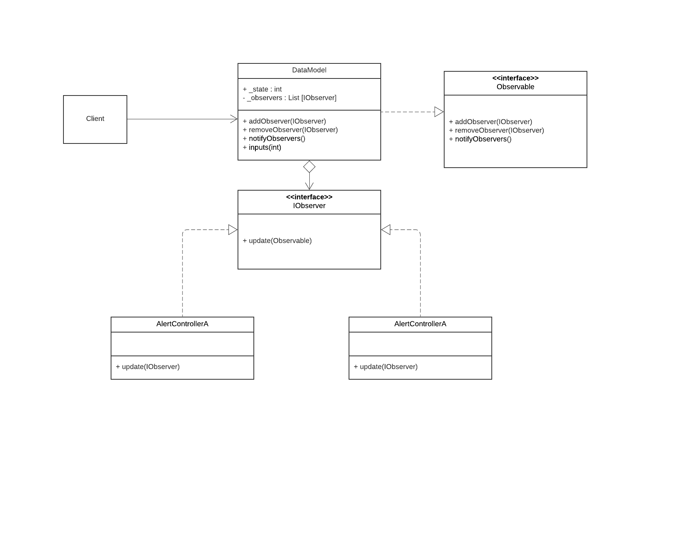

# Observer

The Observer pattern is a software design pattern in which an object called the subject, maintains a list of its dependents, called observers, and notifies them automatically of any state changes, usually by calling one of their method. 

# When to use the Observer pattern

When you need many other objects to receive an update when another object changes. Loose coupling is a benefit.



## Python example

In the example, [observer.py](observer.py)

The Publisher:

DataModel works as a publisher in our python example. Datamodel contain a infrastructure to handle joining of new subscribers and resigning of current subscribers. When a new input is given by the user, the DataModel goes over the subscription list and calls the notification method.

The Subscriber :

The Subscriber interface declares the notification interface. In our case, it consists of a single update method in IObserver interface.

Concrete Subscribers :

AlertControllerA and AlertControllerB are concrete subscribers that perform some actions in response to notifications issued by the publisher. AlertControllerA performs operations and generates Fibonacci sequence while AlertControllerB gives the factorial of user input.

To stop the program use: CTRL+D

## Running the example

```
$ python observer.py

Observable: Attached an observer.
Observable: Attached an observer.
5
DataModel: Received new input: 5
DataModel: Notifying observers...
Fibonacci sequence:
0
1
1
2
3
AlertControllerA: Reacted to the event
The factorial of 5 is 120
AlertControllerB: Reacted to the event
12
DataModel: Received new input: 12
DataModel: Notifying observers...
Fibonacci sequence:
0
1
1
2
3
5
8
13
21
34
55
89
AlertControllerA: Reacted to the event
The factorial of 12 is 479001600
AlertControllerB: Reacted to the event
8
DataModel: Received new input: 8
DataModel: Notifying observers...
Fibonacci sequence:
0
1
1
2
3
5
8
13
AlertControllerA: Reacted to the event
The factorial of 8 is 40320
AlertControllerB: Reacted to the event


```