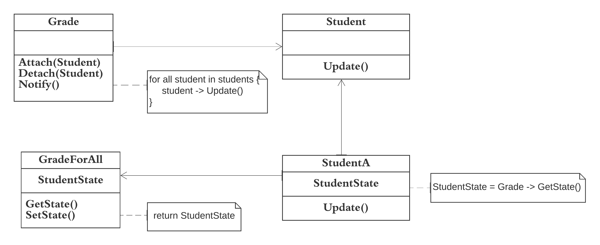

The implementation of Observer design pattern discussed in the Software repository maintenance model example demonstrates the Observer pattern.  

Observer pattern aim is to define a one-to-many relationship such that when one object changes state, the others are notified and updated automatically. If one object is modified, its dependent objects are to be notified automatically  

For example, When students are waiting for the result of their Grades, they are the observers and the Grade is the subject. Once the result of their grades are released, all students are notified about their result.  

The implemented code for Observer can be found [here](observer.rb)   
