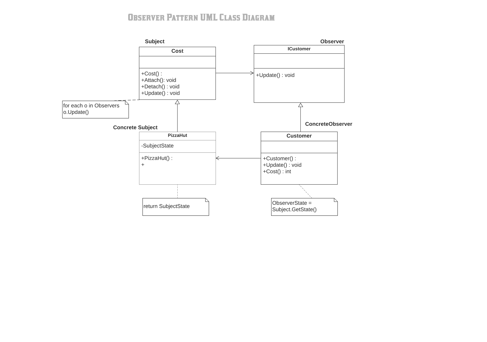

#Observer Pattern

The Observer Pattern is a software design pattern in which an object, called the subject, maintains a list of its dependents, called observers, and notifies them automatically of any state changes, usually by calling one of their methods.

The Observer design pattern is one of the twenty-three well-known "Gang of Four" design patterns that describe how to solve recurring design problems to design flexible and reusable object-oriented software, that is, objects that are easier to implement, change, test, and reuse

What solution does the Observer design pattern describe?

-  Define Subject and Observer objects.
-  So that when a subject changes state, all registered observers are notified and updated automatically (and probably asynchronously).

The classes and objects participating in this pattern are:

1) Subject
-  Knows its observers. Any number of Observer objects may observe a subject
-  Provides an interface for attaching and detaching Observer objects.

2) ConcreteSubject  
-  Stores state of interest to ConcreteObserver
-  Sends a notification to its observers when its state changes

3) Observer  
-  Defines an updating interface for objects that should be notified of changes in a subject.

4) ConcreteObserver   
-  Maintains a reference to a ConcreteSubject object
-  Stores state that should stay consistent with the subject's
-  Implements the Observer updating interface to keep its state consistent with the subject's

