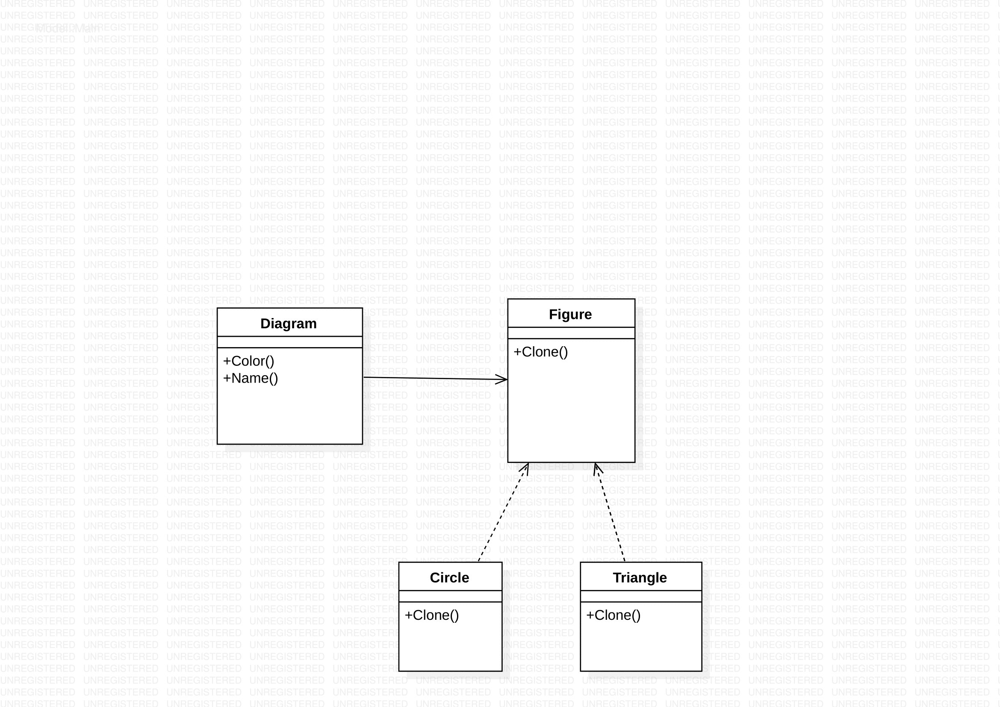
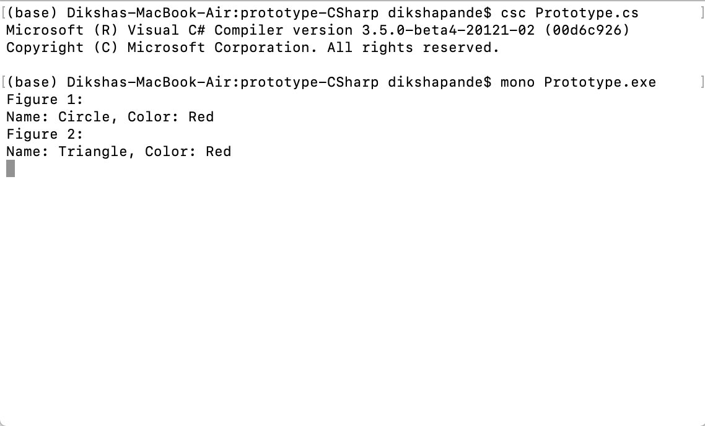

# Prototype pattern

+ The prototype pattern is a creational design pattern in software development. It is used when the type of objects to create is determined by a prototypical instance, which is cloned to produce new objects. This pattern is used to: 1)avoid subclasses of an object creator in the client application, like the factory method pattern does.
2)avoid the inherent cost of creating a new object in the standard way (e.g., using the 'new' keyword) when it is prohibitively expensive for a given application.

+ To explain PrototypeDesignPattern I am taking example of Geometric figures Circle and Traingle.
n C#, when we try to copy one object to another object using the assignment (=) operator, then both the objects will share the same memory address. And the reason is the assignment operator (=) copy the reference, not the object except when there is a value type field. This operator will always copy the reference, not the actual object.In my example we have Diagram class, then I created an instance of Figure class(i.e. fig1) and set its Name and Color Properties. Then I created another Figure instance by assigning existing figure object(fig1).To clone the object to another object C# provides 1 method i.e.MemberwiseClone which will create a complete new copy of the object.

# How to run the program
+ This code contains 1 files Prototype.cs . I used mono to implement C-sharp codes. First command I used to run is csc Prototype.cs . The second command I used to run is mono Prototype.exe. You can run the codes in Visual Studio.

# UML Diagram

# Program Output

