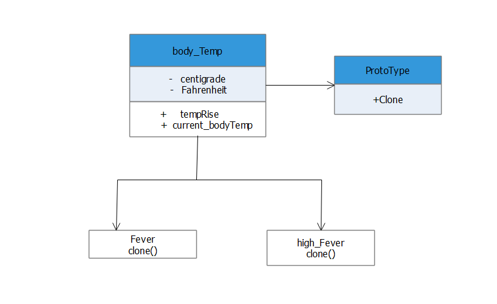

# Prototype


The basic goal of prototype is to create a new object by copying from the original object(prototype) rather than creating a new object from scratch .




## Python example

In the example, [prototype.py](prototype.py)

shallow copy : copy.copy()

Shallow copy creates a copy of that object but references each element of that object.


deep copy   :  copy.deepcopy()

Through deepcopy if any of the changes are made in the new object they are not reflcted in the original object.

The objects that support cloning are called prototypes.

 In the exmaple,


Normal Temperature : Prototype or Original Object

Fever : Clone object after deepcopy

HighFever: Clone Object after deepcopy


Even though normal_temp is cloned several times the original object(i.e prototype ) is not affected.


## Running the example

```
$ python prototype.py

Normal Body Temperature
37 *C, 98.6 *F
Fever
38.5 *C, 101.3 *F
High Fever
40.0 *C, 104.0 *F
No change is made to the prototype object even after cloning(deep copy)
Normal Body Temperature
37 *C, 98.6 *F

```

