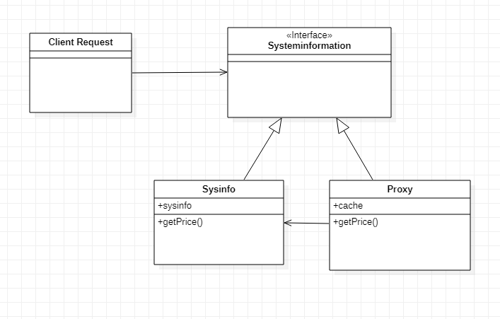

# Proxy Pattern

1. This is a structural design pattern that behaves exactly as its name suggests. It acts as a placeholder for another object to control access to it.

2. It is usually used in situations in which a target object is under constraints and may not be able to handle all its responsibilities efficiently. A proxy, in this case, usually provides the same interface to the client and adds a level of indirection to support controlled access to the target object to avoid undue pressure on it.

3. The proxy pattern can be very useful when working with network request-heavy applications to avoid unnecessary or redundant network requests.

## JavaScript example



1. In this example, we need to get some values from the exteranl service. we will call the service using a function `systeminformation` and it will have a method to get the `price` that will return the price of the product (calling the external service) now return the price of the product based on the input we fetech the price from the external service

2. we can cut the number of external request by a lot. we create a proxy we will cache all the responses from
the server now we need to check if the passed price argument is in the cache. If it exists in the cache, we return the response from there, never invoking the original `systeminformation` function.

3. We can see the output after the first external service call the price is cached and then we get the value from cache instead from calling external service

Output

```
----No Proxy----
External Service Call
$500
External Service Call
$210
External Service Call
$500
External Service Call
$210
----With Proxy----
External Service Call
$500
External Service Call
$210
$500
$210
```