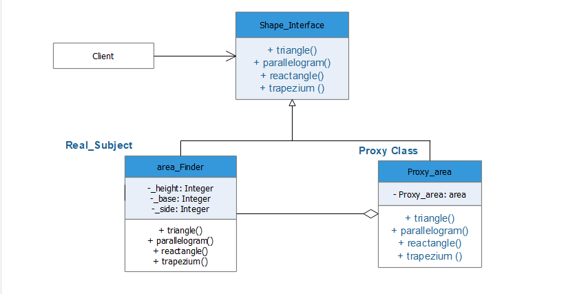

# Proxy:

As the name suggests, the proxy design pattern provides a substitute for an object.
This proxy object works even though the original object is now ready. Since proxy object follows the
the same interface as the original_object it can be passed directly to the client.



## Python example

Code Example [proxy.py](proxy.py): The example presented is used to calculate the area of all the shapes that are
               Mentioned in the shapes interface. Here in the example area_Finder is the real object, and Proxy_area is
               the proxy object. The proxy object is used to add additional functionalities without changing the original object.
               Here in the example, the proxy class not only calculates the area of all the shapes but also used to add conditions
               for evaluation of shapes before or after execution.

### Running the example

```
Area Of Triangle      = 4.0
Area Of Parallelogram = 8
Area of triangle      = 8
Area of trapezium     = 14.0

```
         