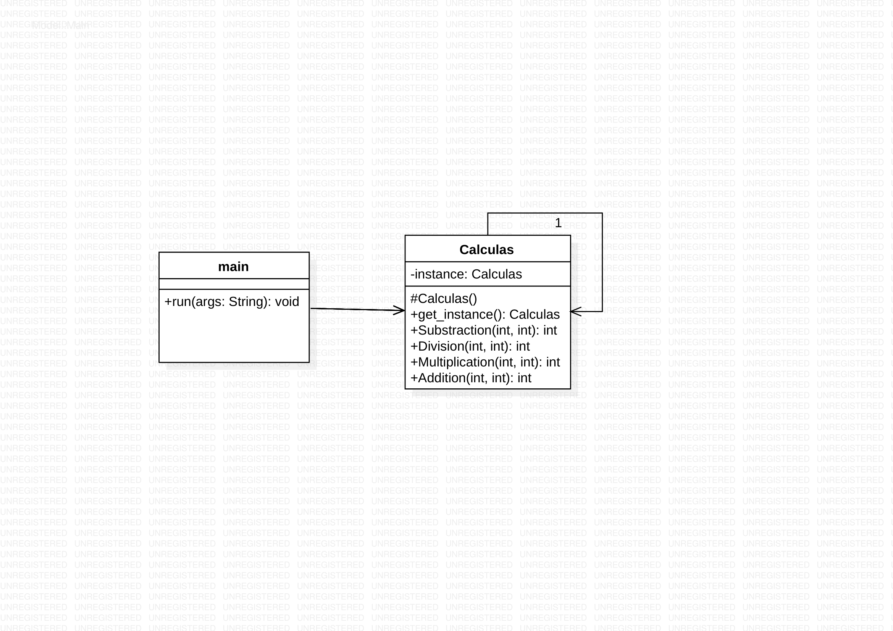

# Singleton pattern
+
+ The Singleton is a creational design pattern that allows us to create a single instance of an object and to share that instance with all the users that require it. It is used to share common data across application, also to reduce overhead of instantiating a heavy object again and again.
To cache objects in-memory and reuse them throughout the application.
+
+ To explain Singleton Design Pattern I am using example of Calculas. I defined the static methods to calculate Addition, Subtraction, Division, Multiplication of integers which takes input parameters. Our class contains the formulas for all the arithmetic operations. We know that the formulas will always remain the same and is totally based on what input parameters we pass.Since the formulas of arithmetic operations always remains the same we can achieve this functionality with the help of static class and static methods. So, create a class named Arithmetic and make it static in the StaticClasses console application. And finally created static methods for all operations.In the main method, we call the static methods by directly referencing through class name Arithmetic.
+
+ This code contains 1 file Singleton.cs . I used mono to implement C-sharp codes. First command I used to run is csc Singleton.cs . The second command I used to run is mono Singleton.exe. You can run the codes in Visual Studio.
+
+ 
