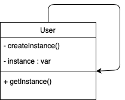
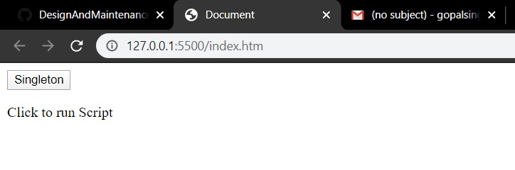
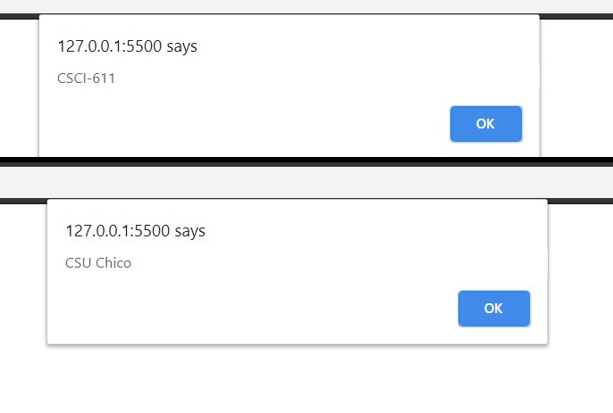
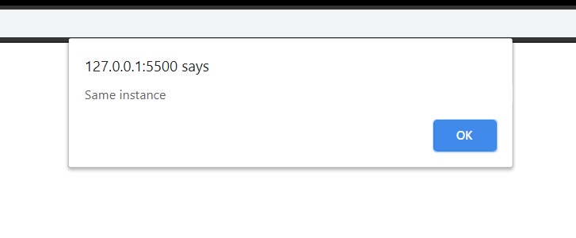

# Singleton

The singleton pattern enables us to create an object instance with global access but is limited to exactly one instance.The Singleton Pattern limits the number of instances of a particular object to just one. This single instance is called the singleton.We have a `User` class and a create instance function and 

# Implementation
In this example, we have considered a user class with two variables 

We will create two instances named instance1 and instance2

We will use the different instances to set variables

Alert `same instance` if both the instances are same

## JavaScript example

In this example we will create two instances and they refer to sigle instance of the class. The alert shows that
both the instances are same that is if no instance is present then only create instace is called or else the same
instance is returned

</img>

After clicking the button both instance1 and instance2 are called

</img>

### Running the example

The provided [singleton.js](singleton.js) file creates multiple `Instance` variables, but as you run it, you will notice that all of them refer to the same instance

</img>
