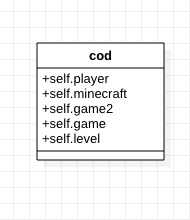

# Singleton

The singleton pattern enables us to create an object instance with global access but is limited to exactly one instance. A practical use of the singleton pattern is to create a master class cod of all the players in a game.

The singleton pattern is used to ensure that there is only one instance of a class and provides global access to that instance.

This pattern is useful when you want one instance of a class and many different objects need to access it, rather than pass the object around, we can make the object global.

The `singleton module` is thorough, it overrides multiple methods to prevent multiple instances of the singleton class. It also uses lazy instantiation, creating the instance only once the `instance` method is called.


* There can be only one class of a given name and therefore only one instance of the singleton.



## Running the example

The provided [main.cpp](main.cpp)

```{bash}
$ ruby main.rb
```